# Climate and weather Data sources

# Climate Hazards Group Infrared Precipitation with Stations (CHIRPS)

---

## Overview
**CHIRPS** is a global precipitation dataset that provides high-resolution rainfall estimates, integrating satellite data with in-situ station data for accurate monitoring.

---

## Data Source
- **Organization**: Climate Hazards Group
- **Website**: [CHG Official Site](https://www.chc.ucsb.edu/data/chirps)
- **Data Access**: [CHIRPS Data Access](https://data.chc.ucsb.edu/products/CHIRPS-2.0/)

---

## Description
- **Temporal Coverage**: 1981 to present
- **Spatial Coverage**: 50°S to 50°N, all longitudes
- **Resolution**: 
  - **Temporal**: Daily, Pentad, Monthly
  - **Spatial**: 0.05° (approx. 5 km)
- **Data Sources**: 
  - Infrared satellite imagery
  - In-situ station data
  - Atmospheric model data

---

## Features
- **High Resolution**: Combines the precision of station data with the broad coverage of satellite imagery.
- **Long-term Data**: Available from 1981 onwards, useful for trend analysis.
- **Frequent Updates**: Data updated in near real-time for timely information.

---

## Applications
- **Agricultural Monitoring**: Helps in drought monitoring and crop assessment.
- **Climate Research**: Essential for studying precipitation patterns and climate change.
- **Disaster Management**: Provides critical data for managing flood risks and water resources.

---

## Useful Links
- [CHIRPS Overview](https://www.chc.ucsb.edu/data/chirps)
- [Data Download](https://data.chc.ucsb.edu/products/CHIRPS-2.0/)
- [Technical Documentation](https://pubs.usgs.gov/ds/832/)
- [Climate Hazards Group](https://www.chc.ucsb.edu/)

---

## Meteostat 

Meteostat is one of the largest vendors of open weather and climate data. Access long-term time series of thousands of weather stations and integrate Meteostat data into your products, applications and workflows. Thanks to our open data policy, Meteostat is an ideal data source for research and educational projects.

### Installation

The Meteostat Python package is available through PyPI

~~~
$ pip install meteostat
~~~
{: .bash}

### Weather Stations

In contrast to other meteorological data interfaces Meteostat does not use a global data model. Instead, Meteostat provides weather observations and long-term climate statistics for individual weather stations. Understandably, no one knows the identifiers of each and every weather station. Therefore, Meteostat provides the Stations class - a simple interface for querying weather stations using several filters.

~~~
# Import Meteostat library
# pip install meteostat
from meteostat import Stations
# Get nearby weather stations
stations = Stations()
stations = stations.nearby(9.03, 38.74,)
station = stations.fetch(1)
# Print DataFrame
print(station)
~~~
{: .python}

~~~
     name country region    wmo  icao  latitude  longitude  elevation            timezone hourly_start hourly_end daily_start  daily_end monthly_start monthly_end     distance
id                                                                                                                                                                                      
63450  Addis Ababa      ET     CN  63450  HAAB    8.9833       38.8     2355.0  Africa/Addis_Ababa   1957-01-01 2024-05-17  1957-02-13 2024-05-10    1898-01-01  2021-01-01  8389.627629
~~~
{: .output}

Let's pretend you want to plot temperature data for Addis Ababa, Ethiopia from 2023:

~~~
# Import Meteostat library and dependencies
from datetime import datetime
import matplotlib.pyplot as plt
from meteostat import Point, Daily

# Set time period
start = datetime(2023, 1, 1)
end = datetime(2023, 12, 31)

# Create Point for Addis Ababa, Ethiopia
addis_ababa = Point(9.03, 38.74, 2355) # lat, lon ,  elevation

# Get daily data for 2023
data = Daily(addis_ababa, start, end)
data = data.fetch()

# Plot line chart including average, minimum and maximum temperature
data.plot(y=['tavg', 'tmin', 'tmax'])
plt.title('Daily Temperature in Addis Ababa for 2023')
plt.xlabel('Date')
plt.ylabel('Temperature (°C)')
plt.legend(['Average Temperature', 'Minimum Temperature', 'Maximum Temperature'])
plt.grid(True)
plt.show()
~~~

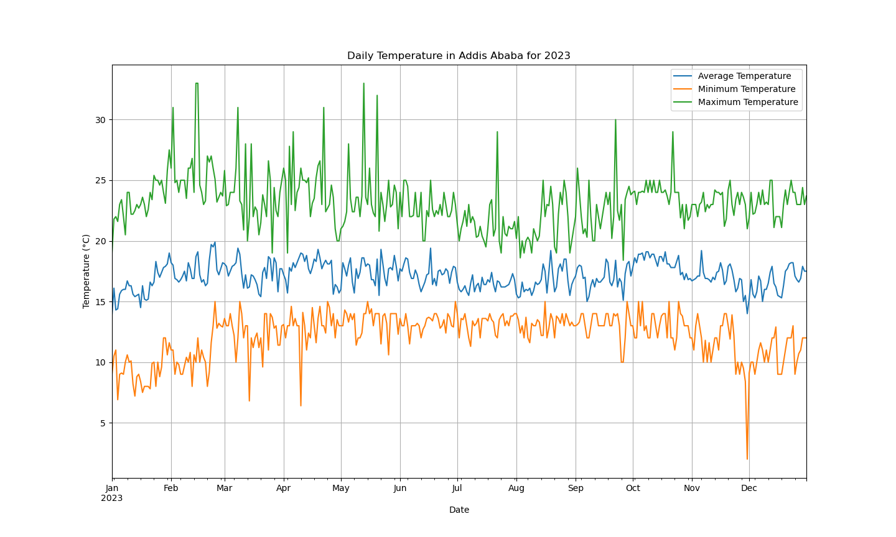

## Copernicus Climate Data Store (CDS)

There are many online services to get climate data, and it is often difficult to know which ones are up-to date and which resources to trust. Also different services provide different Application Programming Interfaces (API), use different terminologies, different file formats etc., which make it difficult for new users to master them all. Therefore in this lesson, we will be focusing on the [Copernicus Climate Change Service (C3S)](https://climate.copernicus.eu/).

## Copernicus Climate Change Service (C3S)

This is a service operated by the [European Centre for Medium-range Weather Forecasts (ECMWF)](https://www.ecmwf.int/) on behalf of the European Union. The [C3S](https://climate.copernicus.eu/) combines observations of the climate system with the latest science to develop authoritative, quality-assured information about the past, current and future states of the climate in Europe and worldwide.

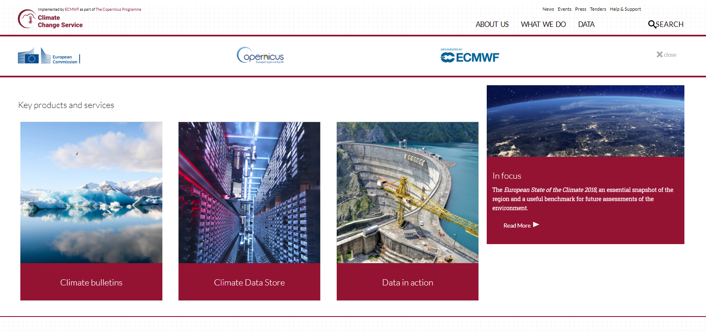

## The Climate Data Store (CDS)

This is a web portal providing a single point of access to a wide range of information. This includes observations (i.e., in-situ measurements, remote sensing data, etc.), historical climate data records, estimates of Essential Climate Variables (ECVs) derived from Earth observations, global and regional climate reanalyses of past observations, seasonal forecasts and climate projections.

### Climate Data Store (CDS) Registration

To be able to use CDS services, you need to [register](https://cds.climate.copernicus.eu/user/login?destination=%2F%23!%2Fhome). Registration to the Climate Data Store (CDS) is free as well as access to climate data.
Before starting, and once registred, login to the Climate Data Store (CDS).

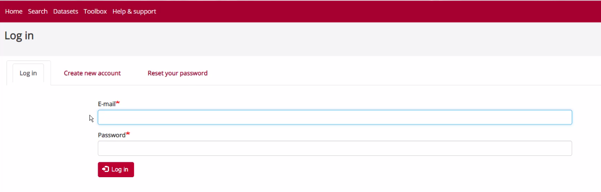

## Retrieve Climate data with CDS API

Using CDS web interface is very useful when you need to retrieve small amount of data and you do not need to customize your request. However, it is often very useful to retrieve climate data directly on the computer where you need to run your postprocessing workflow.

In that case, you can use the CDS API (Application Programming Interface) to retrieve Climate data directly in Python from the Climate Data Store.

We will be using `cdsapi` python package.

### Get your API key

- Make sure you login to the [Climate Data Store](https://cds.climate.copernicus.eu/#!/home)

- Click on your username (top right of the main page) to get your API key.
 
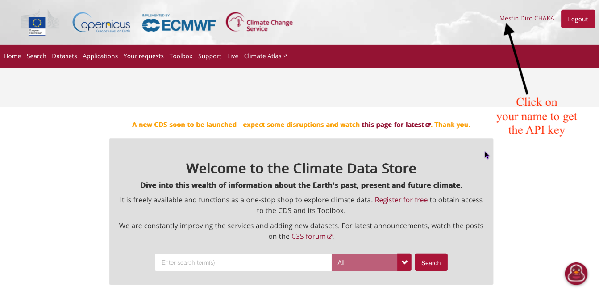

- Copy the code displayed beside, in the file $HOME/.cdsapirc

~~~
url: https://cds.climate.copernicus.eu/api/v2
key: UID:KEY
~~~
{: .bash}

Where UID is your `uid` and KEY your API key. See [documentation](https://cds.climate.copernicus.eu/api-how-to) to get your API and related information.

### Use CDS API

Once the CDS API client is installed, it can be used to request data from the datasets listed in the CDS catalogue. It is necessary to agree to the Terms of Use of every datasets that you intend to download.

Attached to each dataset download form, the button Show API Request displays the python code to be used. The request can be formatted using the interactive form. The api call must follow the syntax:

~~~
import cdsapi
c = cdsapi.Client()

c.retrieve("dataset-short-name", 
           {... sub-selection request ...}, 
           "target-file")
~~~
{: .python}

For instance to retrieve the same ERA5 dataset e.g. near surface air temperature for June 2003:

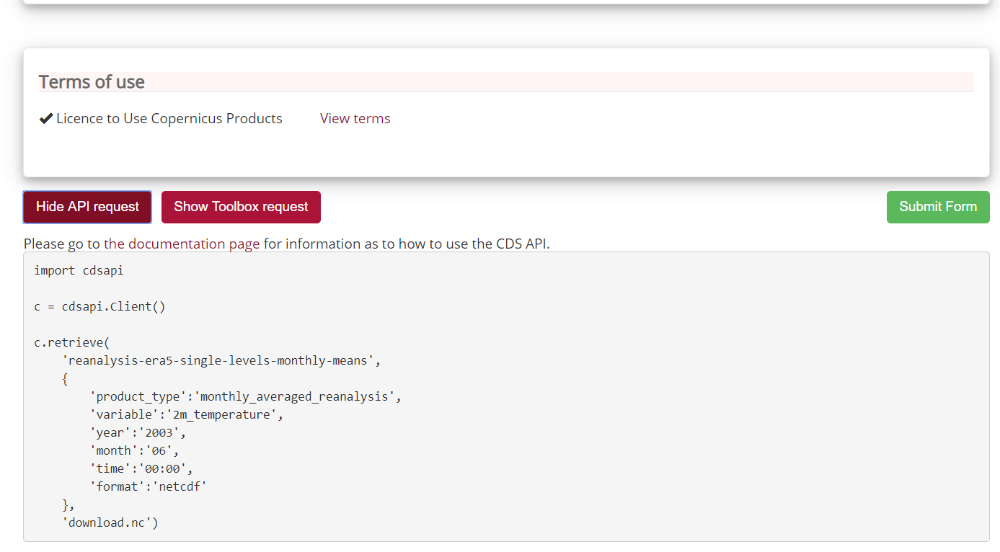

Let’s try it:

~~~
import cdsapi

c = cdsapi.Client()

c.retrieve(
    'reanalysis-era5-single-levels-monthly-means',
    {
        'product_type':'monthly_averaged_reanalysis',
        'variable':'2m_temperature',
        'year':'2003',
        'month':'06',
        'time':'00:00',
        'format':'netcdf'
    },
    'download.nc')
~~~
{: .python}

### Geographical subset

~~~
import cdsapi

c = cdsapi.Client()

c.retrieve(
    'reanalysis-era5-single-levels-monthly-means',
    {      
        'area'          : [60, -10, 50, 2], # North, West, South, East. Default: global
        'product_type':'monthly_averaged_reanalysis',
        'variable':'2m_temperature',
        'year':'2003',
        'month':'06',
        'time':'00:00',
        'format':'netcdf'
    },
    'download_small_area.nc')
~~~
{: .python}

### Change horizontal resolution

For instance to get a coarser resolution:
~~~
import cdsapi

c = cdsapi.Client()

c.retrieve(
    'reanalysis-era5-single-levels-monthly-means',
    {      
        'area'          : [60, -10, 50, 2], # North, West, South, East. Default: global
        'grid'          : [1.0, 1.0], # Latitude/longitude grid: east-west (longitude) and north-south resolution (latitude). Default: 0.25 x 0.25
        'product_type':'monthly_averaged_reanalysis',
        'variable':'2m_temperature',
        'year':'2003',
        'month':'06',
        'time':'00:00',
        'format':'netcdf'
    },
    'download_small.nc')
~~~
{: .python}

More information can be found [here](https://confluence.ecmwf.int/display/CKB/C3S+ERA5%3A+Web+API+to+CDS+API).

### To download CMIP 5 Climate data via CDS API

~~~
import cdsapi

c = cdsapi.Client()

c.retrieve(
    'projections-cmip5-monthly-single-levels',
    {
        'variable':'2m_temperature',
        'model':'noresm1_m',
        'experiment':'historical',
        'ensemble_member':'r1i1p1',
        'period':'185001-200512'
    },
    'download_CMIP5.nc')
~~~
{: .python}

> ## Exercise: Download CMIP5 from Climate Data Store with `cdsapi`
> Get near surface air temperature (2m temperature) and precipitation (mean precipitation flux) in one single request and save the result in a file `cmip5_sfc_monthly_1850-200512.zip`.
> What do you get when you unzip this file?
> > ## Solution
> > 
> >  - Download the file 
> >  - Uncompress it
> >  - If you select one variable, one experiment, one model, etc., then you get one file only, and it is a netCDF file (even if it says otherwise!). As soon as you select more than one variable, or more than one experiment, etc., then you get a zip or tgz (depending on the format you chose).
> >
> > ~~~
> > import cdsapi
> > import os
> > import zipfile
> > c = cdsapi.Client()
> > c.retrieve(
> >     'projections-cmip5-monthly-single-levels', 
> >     { 
> >        'variable': ['2m_temperature',
> >       'mean_precipitation_flux'],
> >        'model': 'noresm1_m',
> >         'experiment': 'historical',
> >         'ensemble_member': 'r1i1p1',
> >         'period': '185001-200512',
> >         'format': 'tgz'
> >     },
> >     'cmip5_sfc_monthly_1850-200512.zip'
> > )
> > os.mkdir("./cmip5")
> > with zipfile.ZipFile('cmip5_sfc_monthly_1850-200512.zip', 'r') as zip_ref:
> >     zip_ref.extractall('./cmip5')
> > ~~~
> > {: .python}
> {: .solution}
{: .challenge}

## Climate Data Store Toolbox

Let’s make the same selection as before. Go to ["your requests"](https://cds.climate.copernicus.eu/cdsapp#!/yourrequests?tab=form) tab and select the last product you downloaded.

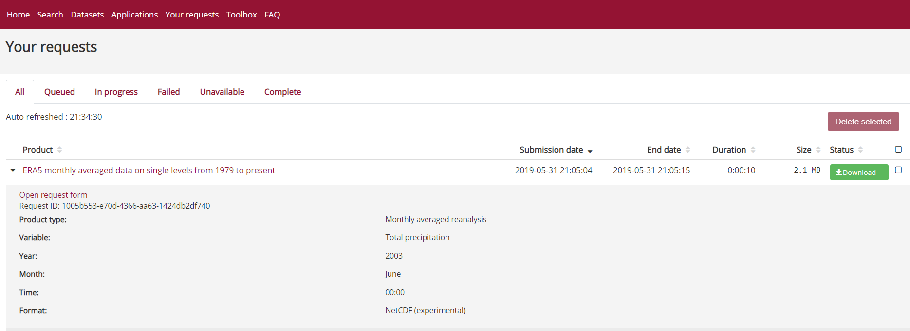

Click on “Open request form” and you will be re-directed to the selection page with all your previous choices already pre-selected.

This time, instead of clicking on “Submit Form”, we click on “Show Toolbox request”:

Copy the content in your clipboard so we can paste it later in the CDS Toolbox.

The CDS Toolbox package is still under active development and the current documentation can be found here.
~~~
mport cdstoolbox as ct  
 data = ct.catalogue.retrieve(  
     'reanalysis-era5-single-levels-monthly-means', 
     {  
         'product_type':'monthly_averaged_reanalysis',  
         'variable':'total_precipitation',  
         'year':'2003', 
         'month':'06',  
         'time':'00:00',    
         'format':'netcdf'  
     }) 
~~~
{: .python}

Then click on “Toolbox” tab to start the CDS toolbox:

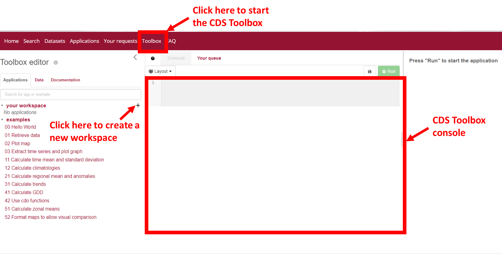

- Create a new workspace and name it ERA5_precipitation (make sure you press the enter button to validate your choice otherwise the new workspace will not be created.
- Finally paste your previous selection in the toolbox console:

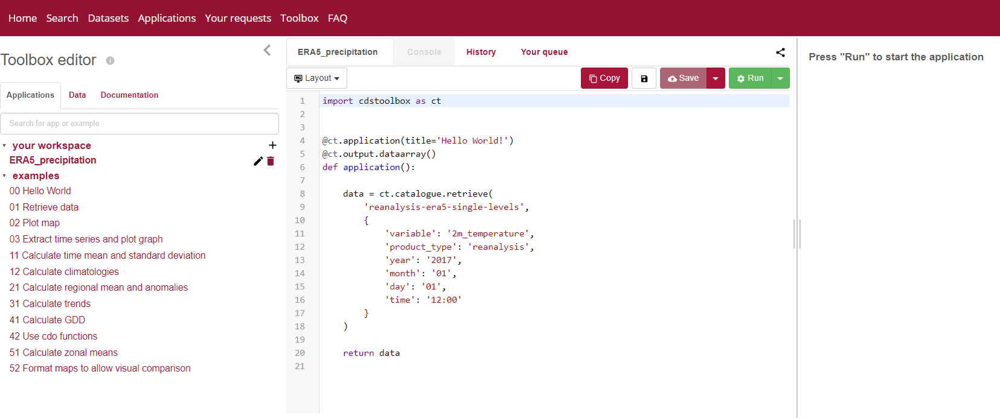

> ## Is it python syntax?
> If you are a python programmer, you probably have recognized the syntax. Otherwise, it may be a bit difficult to understand! The goal here is not to learn how to use the Python CDS toolbox package as it is currently not open source. For now, we make our selection via the web interface and then copy paste the request.
{: .callout}

> ## Climate Data Store (CDS) Registration
> To be able to use CDS services, you need to [register](https://cds.climate.copernicus.eu/user/login?destination=%2F%23!%2Fhome).
> Registration to the Climate Data Store (CDS) is free as well as access to
> climate data.
>
{: .callout}

Before starting, and once registred, login to the Climate Data Store (CDS).

## Search data in the Climate Data Store

Once login, click on the [Search](https://cds.climate.copernicus.eu/cdsapp#!/search) button:

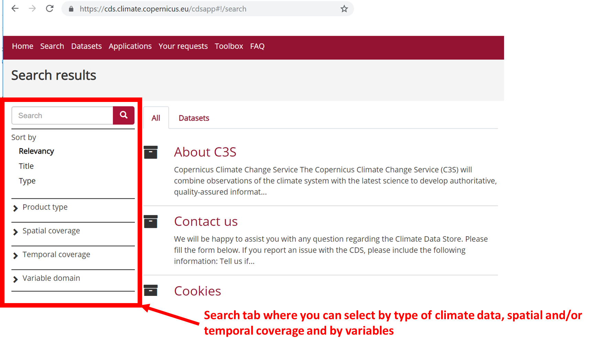

If you click on "Product Type", you will get the list of available climate data types:

- Climate projections
- Reanalysis
- Satellite observations
- Seasonal forecasts
- Sectorial climate indices

> ## Which product type should I choose?
> You probably recognize the first 3 product types from the previous
> lesson, so let us do a small exercise.
>
> Alice is a Master's student working on draught in Europe over the period 1998-2018, and she wants to look at precipitation data for summer months in 2003 to start with (because she heard about a period of excessively hot and dry weather occuring then).
>
> Which product(s) types can she use?
>
> Which criteria could she use to make her final choice?
> > ## Solution
> > Alice could use:
> > - Climate projections
> > - Reanalysis
> > - Satellite observations
> >
> > and her final choice depends on the variable, the spatial and temporal resolution.
> {: .solution}
>
{: .challenge}

You can also search by entering a key word:
- reanalysis
- cmip
- temperature
- precipitation, etc.

When you search, you can make sure you only get datasets (and not documentation, etc.) by selecting the tab "Datasets"

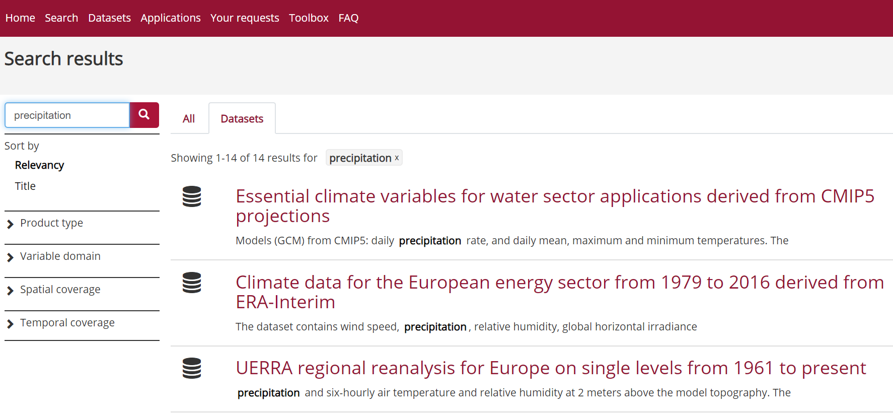

As you can see, it is important to know what you are looking for before starting to download datasets. And the best approach is usually to narrow it down as much as possible to avoid having to download unecessary data. We will see in the next section that the size of the datasets can also be an important criteria to take into account before starting downloading Climate data. 

> ## CMIP data avilable on the Copernicus Climate Data Store 
>
> Not all CMIP-5 and CMIP-6 data are made available through CDS. However,
> you can access all CMIP data through [ESGF](https://esgf.llnl.gov/mission.html) nodes:
> - [CMIP5](https://cmip.llnl.gov/cmip5/)
> - [CMPI6](https://pcmdi.llnl.gov/CMIP6/)).
>
{: .challenge}

## Downloading data from the Climate Data Store

We are nearly there! And the best is to try it out.

Let's search for the latest available re-analysis. We can search for "ERA5" and it will return the list of available datasets:

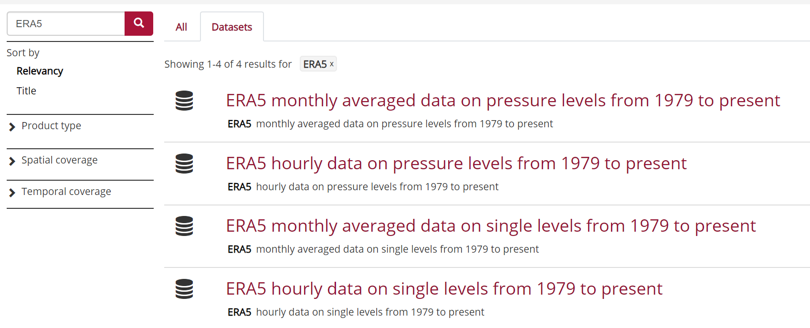

> ## Single level versus pressure levels
>
> Let's stop here and discuss the results of our search:
> - single levels are usually for variables available at (or close) to the surface;
> - data on pressure levels provides information on the vertical structure of the atmosphere.
>
> For many practical applications, using single level (surface) data is sufficient.
{: .callout}

We will select [ERA5 monthly averaged data on single levels from 1979 to present](https://cds.climate.copernicus.eu/cdsapp#!/dataset/reanalysis-era5-single-levels-monthly-means?tab=overview).

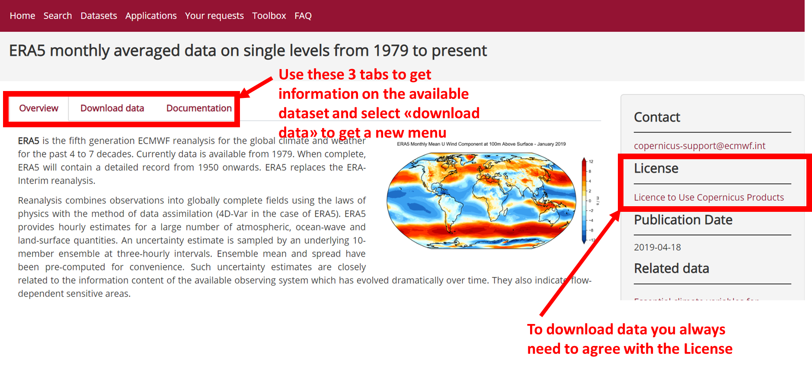

> ## License
> To be able to download datasets from the Climate Data Store, you need to
> agree with the corresponding data license. This agreement can only be done online.
{: .callout}

Click on the tab "Download data" so we can select some ERA5 data to download:

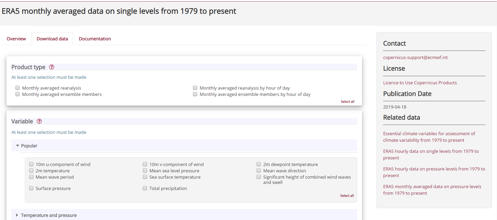

Let's select:
- **Product type**: Monthly averaged reanalysis
- **Popular**: Total precipitation
- **Year**: 2003
- **Month**: June
- **Time**: 00:00
- **Format**: NetCDF 

Make sure you agree to **Terms of use** and then click on **Submit form**:

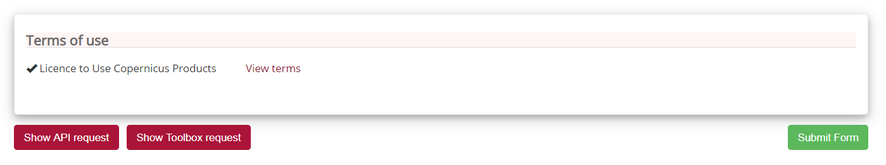

You will then be re-directed to the list of your requests from where you can download your dataset once the retrieval is done:

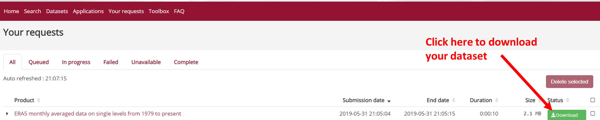

 

If your retrieval is successful then click on the "download" button to download. 
When there is any issue with retrieving data, your request will be "marked" as **failed**.

Please note that in the beginning it is always good practice to select a small sample of data (in the present instance we take only one month) to check that it meets your needs!

Another issue here may be that apart from the variable and date, all the other boxes ticked involve notions that we do not understand yet!

However, for now let's concentrate on the dataset we downloaded to make our first plot.

> ## What is total precipitation?
> 
> When we select **total precipitation** from [ERA5 monthly averaged data on single levels from 1979 to present](https://cds.climate.copernicus.eu/cdsapp#!/dataset/reanalysis-era5-single-levels-monthly-means?tab=form), how can we have a description of the variable?
> 
> Each variable is described in the [Overview](https://cds.climate.copernicus.eu/cdsapp#!/dataset/reanalysis-era5-single-levels-monthly-means?tab=overview).
> 
> - **Total precipitation**: *m* (metre)
> 
> You can also check it in the [Climate Essential Variables](https://gcos.wmo.int/en/essential-climate-variables/ecv-factsheets) where it can be found under [Precipitation](https://ane4bf-datap1.s3.eu-west-1.amazonaws.com/wmod8_gcos/s3fs-public/precipitation_ecv_factsheet_201905.pdf?Y3ybZeunAm83xo9wjBWZg5_Sa50uaXga):
> 
> *Precipitation, either liquid or solid, is the most important climate variable directly affecting humans. Through either its duration, intensity and frequency or its lack of occurrence, it influences the supply of water, causes risks to life and livelihoods when associated with floods, landslides and droughts, and affects infrastructure planning, leisure activities and more. Precipitation is closely related to cloud properties, a number of terrestrial ECVs and to ocean-surface salinity. It is indicative of the release of latent heat within the energy cycle, as well as being at the heart of the hydrological cycle.*
> 
{: .callout}

## What data format for Climate data?

Climate data can become large very quickly (as we usually need to analyze data over large period of time and covering large geographical areas) so we do not store them as text files (i.e., your usual ASCII format, csv files, tabular, etc.) to compress them as much as possible without loosing any important information.

All Climate data are stored in **binary** format and hence are not *human readable*.

Depending on the type of Climate data, you may have the choice between several data formats:

- [GRIB](https://en.wikipedia.org/wiki/GRIB)
- [NetCDF](https://en.wikipedia.org/wiki/NetCDF)

> ## Data format: GRIB versus NetCDF
>
> 
> ### NetCDF
>
> [NetCDF](https://en.wikipedia.org/wiki/NetCDF)  ([Network Common Data Form](https://www.unidata.ucar.edu/software/netcdf/)) is a set of software libraries and self-describing, machine-independent data formats that support the creation, access, and sharing of array-oriented scientific data. NetCDF is commonly used to store and distribute scientific data. 
> The NetCDF software was developed at the [Unidata Program Center](http://www.unidata.ucar.edu/publications/factsheets/current/factsheet_netcdf.pdf) in Boulder, Colorado (USA). 
> NetCDF files usually have the extension *.nc*. 
> As for the GRIB format, NetCDF files are binary and you need to use specific tools to read them. NetCDF files can also be manipulated with most programming languages (R, Python, C, Fortran, etc.).
> 
> For climate and forecast data stored in NetCDF format there are (non-mandatory) conventions on metadata ([CF Convention](http://cfconventions.org/)). 
> 
> ### GRIB
>
> [GRIB](https://en.wikipedia.org/wiki/GRIB) (GRIdded Binary or General Regularly-distributed Information in Binary form) is a file format designed for storing and distributing weather data. GRIB files are mostly used in meteorological applications. The last ECMWF re-analysis (ERA5) is natively encoded in GRIB and also in a version converted from GRIB to NetCDF. Note that due to limitations of the NetCDF specifications, the NetCDF version contains fewer parameters (variables) and incomplete metadata (information about the data). 
> As this format is not widely used there are not as many tools or programming languages supported as netCDF.
>
{: .callout}

Whenever we can, we will choose to download data in NetCDF format but we will also add links to documentation with examples using native GRIB format.

NetCDF format is a binary format and to be able to read or visualize it, we would need to use dedicated software or libraries that can handle this "special" format.

##  Radiant Earth MLHub

To automatically download the dataset, you need an API key from the [Radiant Earth MLHub](https://mlhub.earth/). This is completely free, and will give you access to a growing catalog of ML-ready remote sensing datasets.

~~~
# Set this to your API key (available for free at https://beta.source.coop/auth/registration)
RADIANT_EARTH_API_KEY = ""

data_dir = os.path.join(tempfile.gettempdir(), "cyclone_data")

datamodule = CycloneDataModule(
    root_dir=data_dir,
    seed=1337,
    batch_size=64,
    num_workers=6,
    api_key=RADIANT_EARTH_API_KEY
)

~~~
{: .python}

## [geospatial-datasets](https://torchgeo.readthedocs.io/en/stable/api/datasets.html#geospatial-datasets)

GeoDataset is designed for datasets that contain geospatial information, like latitude, longitude, coordinate system, and projection. Datasets containing this kind of information can be combined using IntersectionDataset and UnionDataset.

In most cases, we'll use `geopandas` to read vector files and analyze data:

~~~
import geopandas as gpd

# Load the countries dataframe using geopandas
countries = gpd.read_file(gpd.datasets.get_path('naturalearth_lowres'))
countries.head()
~~~
{: .python}

We can use shapely attributes and operations to get geometries of interest

~~~
# Plot the union of all african countries
countries[countries["continent"] == "Africa"].unary_union
~~~
{: .python}
