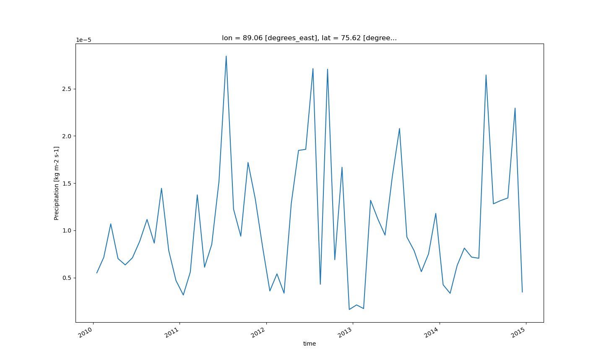
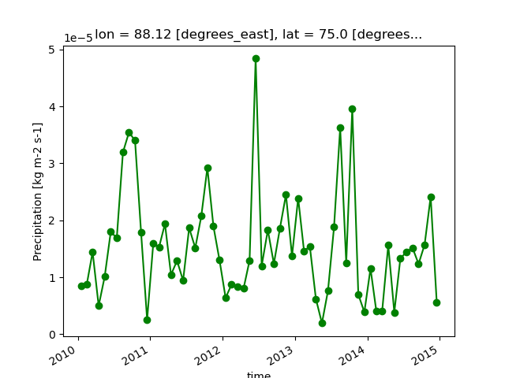
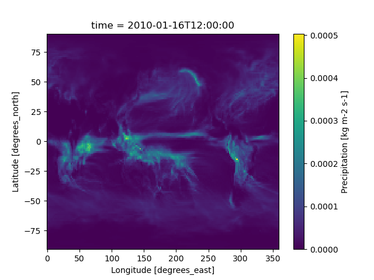
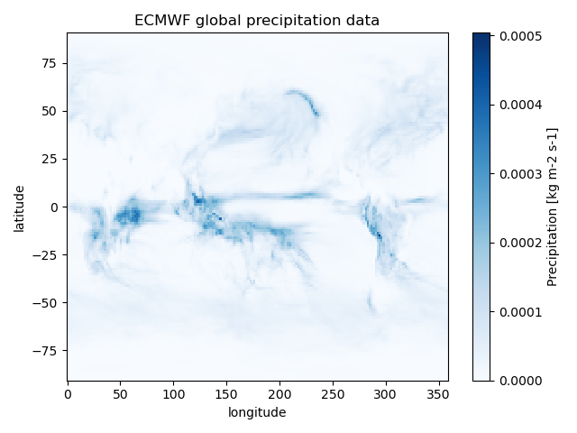
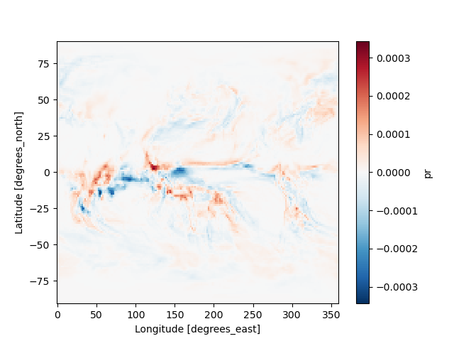
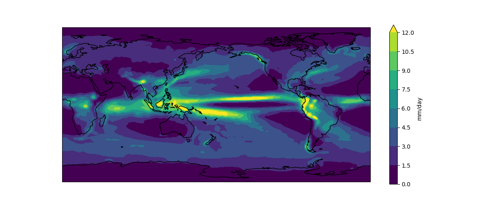
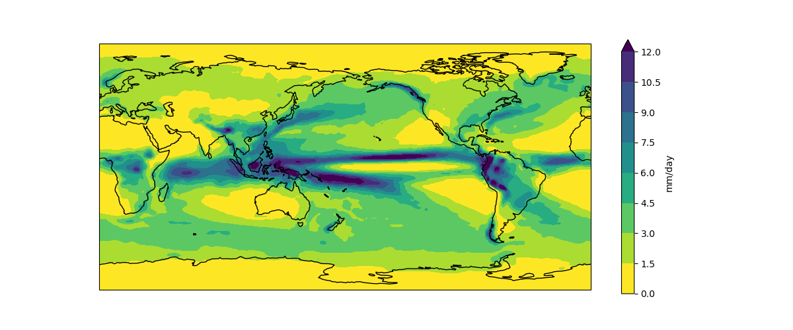
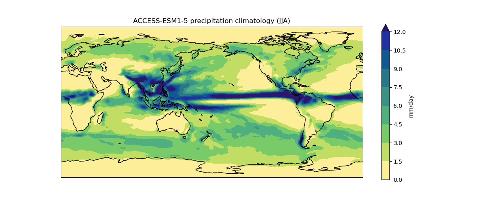
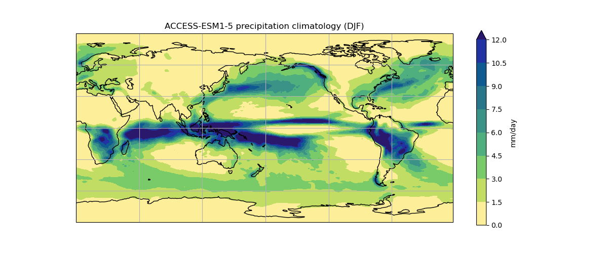

To preprocess datasets for machine learning and deep learning models using Xarray, GeoPandas, and PySAL tools, you can follow these steps:

1. **Data Loading and Preparation**:
   - Use GeoPandas to read and manipulate geospatial vector data, such as shapefiles or GeoJSON files, preparing them for analysis.
   - Leverage Xarray to handle multi-dimensional labeled arrays, which can be beneficial for organizing and preprocessing multi-temporal satellite images or other raster datasets.

2. **Feature Engineering**:
   - Utilize PySAL for advanced spatial analysis to identify spatial patterns and dependencies within the dataset, which can help in feature engineering for machine learning models.
   - Employ GeoPandas to create, manipulate, and analyze geospatial data structures, enabling the extraction of relevant features for model training[2].

3. **Spatial Data Processing**:
   - Use GeoPandas and PySAL to perform spatial operations, such as buffering, spatial joins, and spatial autocorrelation, to enrich the dataset with spatial information for improved model performance[1][2][3].
   - Leverage Xarray for handling and analyzing multi-dimensional raster data, which can be crucial for processing satellite imagery or other spatial datasets before feeding them into machine learning models[3][5].

By integrating the capabilities of Xarray, GeoPandas, and PySAL, you can preprocess geospatial datasets effectively for machine learning and deep learning tasks, ensuring that the data is structured, enriched with spatial information, and ready for model training and analysis.

### Python's Basic in Time Series Data

### Some Useful Pandas Tools

#### Changing Index to Datetime

To convert the index of a pandas DataFrame to datetime format, you can use the `to_datetime` function. Here's how you can do it:

~~~
df.index = df.to_datetime(df.index)
~~~

#### Plotting the Time Series Data

Once the index is in datetime format, you can plot the time series data using the `plot` function:

~~~
df.plot()
~~~
{: .python}

#### Slicing the Data

After converting the index to datetime format, you can slice the data based on specific dates. For example, to get the data for the year 2012:

~~~
df['2012']
~~~
{: .python}

#### Join two dataframes

~~~
df1.join(df2)
~~~
{: .python}

- computing the percentage change and differenes in time series

~~~
df['col'].pct_changes()
df['col'].diff()
~~~
{: .python} 

- pandas correlation method of Series

~~~
df['ABC'].corr(df['XYZ'])
~~~

- Pandas autocorrelation

~~~
df['ABC'].autocorr()
~~~

These tools are essential for working with time series data in Python using the pandas library.

## Correlation of Two Time Series

To understand the correlation between two time series variables, especially in the context of time-dependent data, several key points need to be considered based on the provided sources:

1. **Pearson Correlation and Time Series**:
   - Pearson correlation is commonly used to measure the linear relationship between two variables. However, when dealing with time series data, the assumption of independence between data points may not hold true due to the temporal nature of the data[2].
   - Time series data often exhibits within-series dependence, where observations are correlated over time. This can lead to misleading results when using Pearson correlation, as it assumes independence between data points[2].

2. **Cross-Correlation Function**:
   - The cross-correlation function (CCF) is used to explore how one time series may predict or explain another. It helps in understanding the relationship between two time series variables and can reveal patterns like leading or lagging effects between them[4].

3. **Computing Correlations in Time Series Data**:
   - When analyzing multiple variables in a time series dataset, computing correlations between variables can provide valuable insights. Visualizing correlations as a heat map can help identify patterns, such as positive or negative correlations between variables over time[5].

4. **Practical Application**:

   - In practice, it is essential to consider the temporal aspect of data when calculating correlations between time series variables. Understanding the nuances of time-dependent relationships and the impact of within-series dependence is crucial for accurate analysis and interpretation.

The correlation between two time series variables is a statistical measure that assesses how closely their movements are related over time. This concept is particularly relevant in the context of climate data, where understanding the relationships between different climate variables can provide valuable insights into the dynamics of the Earth's climate system.
For instance, consider a scenario where you are analyzing the relationship between two climate variables: temperature and precipitation. By computing the correlation between these two variables, you can determine if there is a significant association between them. If the correlation is high, it could indicate that changes in temperature are closely linked to changes in precipitation patterns, which could have important implications for understanding and predicting climate trends.

~~~
import pandas as pd
import numpy as np

# Load the data
df = pd.read_csv('climate_data.csv')

# Calculate the correlation
correlation = df['temperature'].corr(df['precipitation'])

print(f'The correlation between temperature and precipitation is: {correlation}')
~~~
{: .python}

# Preprocessing with xarray

We will be exploring the xarray architecture using some sample climate data from the European Centre for Medium-Range Weather Forecasts (ECMWF). We will use their ERA-Intrim climate reanalysis project. You can download the data in netCDF format here. As is the case for many climate products, the process involves downloading large netCDF files to a local machine.

If you visit the ECMWF page you will find that you can download a large number of different climate fields. Here we have prepared tutorial examples around 4 variables. Note that we provide a full resolution (global) version as well as a subsetted version (Alaska). Choose the Alaska data if you are limited for space or processing power on your local computer. 

## multidimensional arrays

N-dimensional arrays of numbers, like NumPy's ndarray, are fundamental in scientific computing, widely used for data representation. Geoscientists, in particular, rely on arrays to structure their data. For instance, climate scientists work with spatially and temporally varying climate variables (e.g., temperature, precipitation) on gridded datasets. Tasks include subsetting global grids for regional analysis, selecting specific time slices, and applying statistical functions to derive summary insights from these subsets.

The tools in this tutorial have some similarity to raster image processing tools. Both require computational engines that can manipulate large stacks of data formatted as arrays. Here we focus on tools that are optimized to handle data that have many variables spanning dimensions of time and space. See the raster tutorials for tools that are optimized for image processing of remote sensing datasets.

## Conventional Approach: Working with Unlabelled Arrays

Multidimensional array data are typically stored in custom binary formats and accessed through proprietary libraries (e.g., Fortran or C++). Users must manage file structures and write custom code to handle these files. Data subsetting involves loading the entire dataset into memory and using nested loops with conditional statements to identify specific index ranges for temporal or spatial slices. Additionally, matrix algebra techniques are employed to summarize data across spatial and temporal dimensions.

## Challenges

Working with N-dimensional arrays in this manner presents a significant challenge due to the disconnect between the data and its metadata. Users often struggle to interpret array indices without context, leading to inefficiencies and errors. Common issues arise when determining the placement of critical dimensions within the array or ensuring alignment after data manipulation tasks like resampling.

## The Network Common Data Format

The Network Common Data Form (netCDF) was developed in the early 1990s to address the complexities of handling N-dimensional arrays. NetCDF offers self-describing, platform-independent binary data formats and tools that simplify the creation, access, and sharing of scientific data stored in multidimensional arrays, complete with metadata. Initially designed by the climate science community to manage the growing size of regional climate model outputs, netCDF has evolved to merge with HDF5, enhancing data storage capabilities.

## Practical Use of NetCDF

NetCDF has become a standard for distributing N-dimensional arrays, with various scientific communities relying on its software tools for data processing and visualization. While some researchers exclusively utilize netCDF toolkits for tasks like subsetting and grouping, others leverage NetCDF primarily for data serialization. In cases where standard tools lack the required flexibility for specific research needs, users resort to custom coding methods for statistical analysis and subsetting operations.

## Handling Large Arrays

NetCDF imposes no file size limits, but processing tools are constrained by available memory when reading data for computational tasks. As multidimensional datasets expand in size due to higher resolutions and advanced sensing technologies, managing these large datasets becomes increasingly challenging for computational resources.

## xarray Architecture

To delve into the architecture of xarray, we initiate by importing the xarray library into our Python environment

~~~
import xarray as xr
~~~

The next step involves opening the data file and loading it into a Dataset object. It is crucial to note that the choice of engine for opening the dataset depends on the specific format of the netCDF file being utilized. This decision is pivotal for ensuring seamless data access and manipulation. Here is an example of opening a netCDF file and loading it into a Dataset:

~~~
dset = xr.open_dataset('../data/pr_Amon_ACCESS-CM2_historical.nc')
~~~
{: .python}

By executing the above code snippet, we establish a Dataset object named `ds` that encapsulates the data from the specified netCDF file. This Dataset serves as a central data structure within xarray, enabling efficient handling of multidimensional data arrays and facilitating various data processing and visualization tasks.

### Dataset Properties

Next we will ask xarray to display some of the parameters of the Dataset. To do this simply return the contents of the Dataset variable name

~~~
ds
~~~
{: .python}

~~~
<xarray.Dataset>
Dimensions:    (time: 60, bnds: 2, lon: 192, lat: 144)
Coordinates:
  * time       (time) datetime64[ns] 2010-01-16T12:00:00 ... 2014-12-16T12:00:00
  * lon        (lon) float64 0.9375 2.812 4.688 6.562 ... 355.3 357.2 359.1
  * lat        (lat) float64 -89.38 -88.12 -86.88 -85.62 ... 86.88 88.12 89.38
Dimensions without coordinates: bnds
Data variables:
    time_bnds  (time, bnds) datetime64[ns] ...
    lon_bnds   (lon, bnds) float64 ...
    lat_bnds   (lat, bnds) float64 ...
    pr         (time, lat, lon) float32 ...
Attributes: (12/50)
    CDI:                    Climate Data Interface version 1.9.8 (https://mpi...
    source:                 ACCESS-CM2 (2019): \naerosol: UKCA-GLOMAP-mode\na...
    institution:            CSIRO (Commonwealth Scientific and Industrial Res...
    Conventions:            CF-1.7 CMIP-6.2
    activity_id:            CMIP
    branch_method:          standard
    ...                     ...
    cmor_version:           3.4.0
    tracking_id:            hdl:21.14100/b4dd0f13-6073-4d10-b4e6-7d7a4401e37d
    license:                CMIP6 model data produced by CSIRO is licensed un...
    CDO:                    Climate Data Operators version 1.9.8 (https://mpi...
    history:                Tue Jan 12 14:50:25 2021: ncatted -O -a history,p...
    NCO:                    netCDF Operators version 4.9.2 (Homepage = http:/...
~~~
{: .output}

### Extracting DataArrays from a Dataset

We have queried the dataset details about our Datset dimensions, coordinates and attributes. Next we will look at the variable data contained within the dataset. In the graphic above, there are two variables (temperature and precipitation). As described above, xarray stores these observations as a DataArray, which is similar to a conventional array you would find in numpy or matlab.

Extracting a DataArray for processing is simple. From the Dataset metadata shown above, notice that the name of the climate variable is ‘t2m’ (2 meter air temperature). Suppose we want to extract that array for processing and store it to a new variable called temperature:

~~~
precipitation = dset['pr']
precipitation
~~~
{: .python}

Now, take a look at the contents of the `precipitation` variable. Note that the associated coordinates and attributes get carried along for the ride. Also note that we are still not reading any data into memory.

~~~
<xarray.DataArray 'pr' (time: 60, lat: 144, lon: 192)>
[1658880 values with dtype=float32]
Coordinates:
  * time     (time) datetime64[ns] 2010-01-16T12:00:00 ... 2014-12-16T12:00:00
  * lon      (lon) float64 0.9375 2.812 4.688 6.562 ... 353.4 355.3 357.2 359.1
  * lat      (lat) float64 -89.38 -88.12 -86.88 -85.62 ... 86.88 88.12 89.38
Attributes:
    standard_name:  precipitation_flux
    long_name:      Precipitation
    units:          kg m-2 s-1
    comment:        includes both liquid and solid phases
    cell_methods:   area: time: mean
    cell_measures:  area: areacella
~~~
{: .output}

### Indexing

Indexing is used to select specific elements from xarray files. Let’s select some data from the 2-meter temperature DataArray. We know from the previous lesson that this DataArray has dimensions of time and two dimensional space (latitude and longitude).

You are probably already used to conventional ways of indexing an array. You will know in advance that the first array index is time, the second is latitude, and so on. You would then use positional indexing):

~~~
dset['pr'][0, 0, 0]
~~~
{: .python}

~~~
Out[22]: 
<xarray.DataArray 'pr' ()>
[1 values with dtype=float32]
Coordinates:
    time     datetime64[ns] 2010-01-16T12:00:00
    lon      float64 0.9375
    lat      float64 -89.38
Attributes:
    standard_name:  precipitation_flux
    long_name:      Precipitation
    units:          kg m-2 s-1
    comment:        includes both liquid and solid phases
    cell_methods:   area: time: mean
    cell_measures:  area: areacella
~~~
{: .output}

This method of handling arrays should be familiar to anyone who has worked with arrays in MATLAB or NumPy. One challenge with this approach: it is not simple to associate an integer index position with something meaningful in our data. For example, we would have to write some function to map a specific date in the time dimension to its associated integer. Therefore, xarray lets us perform positional indexing using labels instead of integers:

~~~
dset['pr'].loc['2010-01-16T12:00:00', :, :]
~~~
{: .python}

~~~
<xarray.DataArray 'pr' (lat: 144, lon: 192)>
[27648 values with dtype=float32]
Coordinates:
    time     datetime64[ns] 2010-01-16T12:00:00
  * lon      (lon) float64 0.9375 2.812 4.688 6.562 ... 353.4 355.3 357.2 359.1
  * lat      (lat) float64 -89.38 -88.12 -86.88 -85.62 ... 86.88 88.12 89.38
Attributes:
    standard_name:  precipitation_flux
    long_name:      Precipitation
    units:          kg m-2 s-1
    comment:        includes both liquid and solid phases
    cell_methods:   area: time: mean
    cell_measures:  area: areacella
~~~
{: .output}

This is great, but we still need to be keeping track of the fact that our index position 1 is the time dimension, position 2 is latitude, etc. So rather than looking up our dimension by position, xarray enables us to use the dimension name instead:

~~~
dset['pr'].isel(time=0, lat=0, lon=0)
~~~
{: .python}

~~~
<xarray.DataArray 'pr' ()>
[1 values with dtype=float32]
Coordinates:
    time     datetime64[ns] 2010-01-16T12:00:00
    lon      float64 0.9375
    lat      float64 -89.38
Attributes:
    standard_name:  precipitation_flux
    long_name:      Precipitation
    units:          kg m-2 s-1
    comment:        includes both liquid and solid phases
    cell_methods:   area: time: mean
    cell_measures:  area: areacella
~~~
{: .output}

Here, the isel method refers to a selection by integer position. Finally, we can combine the benefits of both a labeled index and a named dimension as follows:

~~~
dset['pr'].sel(time='2010-01-16T12:00:00', lat=86.88, lon=89.38, method='nearest')
~~~
{: .python}

~~~
<xarray.DataArray 'pr' ()>
[1 values with dtype=float32]
Coordinates:
    time     datetime64[ns] 2010-01-16T12:00:00
    lon      float64 89.06
    lat      float64 86.88
Attributes:
    standard_name:  precipitation_flux
    long_name:      Precipitation
    units:          kg m-2 s-1
    comment:        includes both liquid and solid phases
    cell_methods:   area: time: mean
    cell_measures:  area: areacella
~~~
{: .output}

## Plotting data in 1 dimension
Let’s start visualizing some of the data slices we’ve been working on so far. We will begin by creating a new variable for plotting a 1-dimensional time series:

~~~
lat_value = 75.0
lon_value = 89.0

lat_index = dset['lat'].sel(lat=lat_value, method='nearest').values
lon_index = dset['lon'].sel(lon=lon_value, method='nearest').values

time_series = dset['pr'].sel(time=slice('2010-01-16T12:00:00', '2014-12-16T12:00:00'), lat=lat_index, lon=lon_index)
time_series.plot()
~~~
{: .python}

Your plots can be customized using syntax that is very similar to Matplotlib. For example:

~~~
time_series.plot.line(color='green', marker='o')
~~~
{: .python}

### Plotting data in 2 dimensions

Since many xarray applications involve geospatial datasets, xarray’s plotting extends to maps in 2 dimensions. Let’s first select a 2-D subset of our data by choosing a single date and retaining all the latitude and longitude dimensions:

~~~
map_data = dset['pr'].sel(time='2010-01-16T12:00:00')
map_data.plot()
~~~
{: .python}

Note that in the above label-based lookup, we did not specify the latitude and longitude dimensions, in which case xarray assumes we want to return all elements in those dimensions.

Customization can occur following standard Matplotlib syntax. Note that before we use matplotlib, we will have to import that library:

~~~
import matplotlib.pyplot as plt
map_data.plot(cmap=plt.cm.Blues)
plt.title('ECMWF global precipitation data')
plt.ylabel('latitude')
plt.xlabel('longitude')
plt.tight_layout()
plt.show()
~~~
{: .python}

# Data processing and visualisation

## Arithmetic

Suppose we want to plot the difference in air precipitation between January 1 in 2010 versus 2011. We can do this by taking advantage of xarray’s labeled dimensions to simplify arithmetic operations on DataArray objects:

~~~
precipitation1 = dset['pr'].sel(time='2010-01-16T12:00:00')
precipitation2 = dset['pr'].sel(time='2011-01-16T12:00:00')
delta = precipitation1 - precipitation2
delta.plot()
~~~
{: .python}

Note that the subtraction is automatically vectorized over all array values, as in numpy.

We can actually use either the dset['pr'] or dset.pr syntax to access the precipitation xarray.DataArray.

To calculate the precipitation climatology, we can make use of the fact that xarray DataArrays have built in functionality for averaging over their dimensions.

~~~
clim = dset['pr'].mean('time', keep_attrs=True)
print(clim)
~~~
{: .python}

~~~
<xarray.DataArray 'pr' (lat: 145, lon: 192)>
array([[2.4761673e-06, 2.4761673e-06, 2.4761673e-06, ..., 2.4761673e-06,
        2.4761673e-06, 2.4761673e-06],
       [2.2970205e-06, 2.2799834e-06, 2.2585127e-06, ..., 2.3540958e-06,
        2.3336945e-06, 2.3136067e-06],
       [2.0969844e-06, 2.0686068e-06, 2.0382870e-06, ..., 2.1673986e-06,
        2.1523117e-06, 2.1302694e-06],
       ...,
       [8.7852204e-06, 8.8236175e-06, 8.8202569e-06, ..., 8.7430153e-06,
        8.7706394e-06, 8.7947683e-06],
       [8.4821795e-06, 8.4632229e-06, 8.4983958e-06, ..., 8.4181611e-06,
        8.4009334e-06, 8.4525291e-06],
       [7.7492014e-06, 7.7492014e-06, 7.7492014e-06, ..., 7.7492014e-06,
        7.7492014e-06, 7.7492014e-06]], dtype=float32)
Coordinates:
  * lon      (lon) float64 0.0 1.875 3.75 5.625 7.5 ... 352.5 354.4 356.2 358.1
  * lat      (lat) float64 -90.0 -88.75 -87.5 -86.25 ... 86.25 87.5 88.75 90.0
Attributes:
    standard_name:  precipitation_flux
    long_name:      Precipitation
    units:          kg m-2 s-1
    comment:        includes both liquid and solid phases
    cell_methods:   area: time: mean
    cell_measures:  area: areacella
~~~
{: .output}

so we can go ahead and multiply that array by 86400 and update the units attribute accordingly:

~~~
clim.data = clim.data * 86400
clim.attrs['units'] = 'mm/day' 

print(clim)
~~~
{: .python}

~~~
<xarray.DataArray 'pr' (lat: 145, lon: 192)>
array([[0.21394086, 0.21394086, 0.21394086, ..., 0.21394086, 0.21394086,
        0.21394086],
       [0.19846257, 0.19699057, 0.1951355 , ..., 0.20339388, 0.20163121,
        0.19989562],
       [0.18117945, 0.17872763, 0.176108  , ..., 0.18726324, 0.18595973,
        0.18405528],
       ...,
       [0.75904304, 0.76236055, 0.76207019, ..., 0.75539652, 0.75778324,
        0.75986798],
       [0.73286031, 0.73122246, 0.7342614 , ..., 0.72732912, 0.72584065,
        0.73029851],
       [0.669531  , 0.669531  , 0.669531  , ..., 0.669531  , 0.669531  ,
        0.669531  ]])
Coordinates:
  * lon      (lon) float64 0.0 1.875 3.75 5.625 7.5 ... 352.5 354.4 356.2 358.1
  * lat      (lat) float64 -90.0 -88.75 -87.5 -86.25 ... 86.25 87.5 88.75 90.0
Attributes:
    standard_name:  precipitation_flux
    long_name:      Precipitation
    units:          mm/day
    comment:        includes both liquid and solid phases
    cell_methods:   area: time: mean
    cell_measures:  area: areacella
~~~
{: .output}

We could now go ahead and plot our climatology using matplotlib, but it would take many lines of code to extract all the latitude and longitude information and to setup all the plot characteristics. Recognising this burden, the xarray developers have built on top of matplotlib.pyplot to make the visualisation of xarray DataArrays much easier.

~~~
import cartopy.crs as ccrs

fig = plt.figure(figsize=[12,5])

ax = fig.add_subplot(111, projection=ccrs.PlateCarree(central_longitude=180))

clim.plot.contourf(ax=ax,
                   levels=np.arange(0, 13.5, 1.5),
                   extend='max',
                   transform=ccrs.PlateCarree(),
                   cbar_kwargs={'label': clim.units})
ax.coastlines()

plt.show()
~~~
{: .python}

The default colorbar used by matplotlib is viridis. It used to be jet, but that was changed a couple of years ago in response to the #endtherainbow campaign.

Putting all the code together (and reversing viridis so that wet is purple and dry is yellow)…

~~~
import xarray as xr
import cartopy.crs as ccrs
import matplotlib.pyplot as plt
import numpy as np

accesscm2_pr_file = 'data/pr_Amon_ACCESS-ESM1-5_historical.nc'

dset = xr.open_dataset(accesscm2_pr_file)

clim = dset['pr'].mean('time', keep_attrs=True)

clim.data = clim.data * 86400
clim.attrs['units'] = 'mm/day'

fig = plt.figure(figsize=[12,5])
ax = fig.add_subplot(111, projection=ccrs.PlateCarree(central_longitude=180))
clim.plot.contourf(ax=ax,
                   levels=np.arange(0, 13.5, 1.5),
                   extend='max',
                   transform=ccrs.PlateCarree(),
                   cbar_kwargs={'label': clim.units},
                   cmap='viridis_r')
ax.coastlines()
plt.show()
~~~
{: .python}

## Mathematical functions

Now, sometimes we need to apply mathematical functions to array data in our analysis. A good example is wind data, which are often distributed as orthogonal “u” and “v” wind components. To calculate the wind magnitude we need to take the square root of the sum of the squares. For this we use numpy ufunc commands that can operate on a DataArray. Let’s look at our wind datasets:

~~~
import xarray as xr
import cartopy.crs as ccrs
import matplotlib.pyplot as plt
import numpy as np
import cmocean

accesscm2_pr_file = 'data/pr_Amon_ACCESS-ESM1-5_historical.nc'

dset = xr.open_dataset(accesscm2_pr_file)

clim = dset['pr'].groupby('time.season').mean('time', keep_attrs=True)

clim.data = clim.data * 86400
clim.attrs['units'] = 'mm/day'

fig = plt.figure(figsize=[12,5])
ax = fig.add_subplot(111, projection=ccrs.PlateCarree(central_longitude=180))
clim.sel(season='JJA').plot.contourf(ax=ax,
                                     levels=np.arange(0, 13.5, 1.5),
                                     extend='max',
                                     transform=ccrs.PlateCarree(),
                                     cbar_kwargs={'label': clim.units},
                                     cmap=cmocean.cm.haline_r)
ax.coastlines()

model = dset.attrs['source_id']
title = f'{model} precipitation climatology (JJA)'
plt.title(title)

plt.show()
~~~
{: .python}

If we wanted to create a similar plot for a different model and/or different month, we could cut and paste the code and edit accordingly. The problem with that (common) approach is that it increases the chances of a making a mistake. If we manually updated the season to ‘DJF’ for the clim.sel(season= command but forgot to update it when calling plt.title, for instance, we’d have a mismatch between the data and title.

The cut and paste approach is also much more time consuming. If we think of a better way to create this plot in future (e.g. we might want to add gridlines using plt.gca().gridlines()), then we have to find and update every copy and pasted instance of the code.

A better approach is to put the code in a function. The code itself then remains untouched, and we simply call the function with different input arguments.

~~~
def plot_pr_climatology(pr_file, season, gridlines=False):
    """Plot the precipitation climatology.
    
    Args:
      pr_file (str): Precipitation data file
      season (str): Season (3 letter abbreviation, e.g. JJA)
      gridlines (bool): Select whether to plot gridlines
    
    """

    dset = xr.open_dataset(pr_file)

    clim = dset['pr'].groupby('time.season').mean('time', keep_attrs=True)

    clim.data = clim.data * 86400
    clim.attrs['units'] = 'mm/day'

    fig = plt.figure(figsize=[12,5])
    ax = fig.add_subplot(111, projection=ccrs.PlateCarree(central_longitude=180))
    clim.sel(season=season).plot.contourf(ax=ax,
                                          levels=np.arange(0, 13.5, 1.5),
                                          extend='max',
                                          transform=ccrs.PlateCarree(),
                                          cbar_kwargs={'label': clim.units},
                                          cmap=cmocean.cm.haline_r)
    ax.coastlines()
    if gridlines:
        plt.gca().gridlines()
    
    model = dset.attrs['source_id']
    title = f'{model} precipitation climatology ({season})'
    plt.title(title)
~~~
{: .python}

The docstring allows us to have good documentation for our function:

~~~
help(plot_pr_climatology)
~~~
{: .python}

~~~
Help on function plot_pr_climatology in module __main__:

plot_pr_climatology(pr_file, season, gridlines=False)
    Plot the precipitation climatology.
    
    Args:
      pr_file (str): Precipitation data file
      season (str): Season (3 letter abbreviation, e.g. JJA)
      gridlines (bool): Select whether to plot gridlines
~~~
{: .output}

We can now use this function to create exactly the same plot as before:

~~~
plot_pr_climatology('data/pr_Amon_ACCESS-ESM1-5_historical.nc', 'JJA')
plt.show()
~~~
{: .python}

Or use the optional gridlines input argument to change the default behaviour of the function (keyword arguments are usually used for options that the user will only want to change occasionally):

~~~
plot_pr_climatology('data/pr_Amon_ACCESS-ESM1-5_historical.nc','DJF', gridlines=True)
plt.show()
~~~
{: .python}

## Large data with dask

So far we’ve been working with small, individual data files that can be comfortably read into memory on a modern laptop. What if we wanted to process a larger dataset that consists of many files and/or much larger file sizes? For instance, let’s say the next step in our global precipitation analysis is to plot the daily maximum precipitation over the 1850-2014 period for the high resolution CNRM-CM6-1-HR model.

~~~
import glob
pr_files = glob.glob('data/pr_*.nc')
pr_files.sort()
print(pr_files)
~~~
{: .python}

~~~
['data/pr_Amon_ACCESS-CM2_historical.nc', 'data/pr_Amon_ACCESS-ESM1-5_historical.nc']
~~~
{: .output}

~~~
import xarray as xr
import glob
pr_files = glob.glob('data/ERSSTv5_*.nc')
pr_files.sort()

dset = xr.open_mfdataset(pr_files, combine = 'nested', concat_dim="time", chunks={'time': '500MB'})

print(dset)

~~~
{: .python}

~~~
<xarray.Dataset>
Dimensions:  (time: 859, lat: 89, lon: 180)
Coordinates:
  * time     (time) object 1950-06-01 00:00:00 ... 2021-12-15 00:00:00
  * lat      (lat) float64 -88.0 -86.0 -84.0 -82.0 -80.0 ... 82.0 84.0 86.0 88.0
  * lon      (lon) float64 0.0 2.0 4.0 6.0 8.0 ... 350.0 352.0 354.0 356.0 358.0
Data variables:
    sst      (time, lat, lon) float64 dask.array<chunksize=(859, 89, 180), meta=np.ndarray>
~~~
{: .output}

We can see that our dset object is an xarray.Dataset, but notice now that each variable has type dask.array with a chunksize attribute. Dask will access the data chunk-by-chunk (rather than all at once), which is fortunate because at 45GB the full size of our dataset is much larger than the available RAM on our laptop (17GB in this example). Dask can also distribute chunks across multiple cores if we ask it to (i.e. parallel processing).

So how big should our chunks be? As a general rule they need to be small enough to fit comfortably in memory (because multiple chunks can be in memory at once), but large enough to avoid the time cost associated with asking Dask to manage/schedule lots of little chunks. The Dask documentation suggests that chunk sizes between 10MB-1GB are common, so we’ve set the chunk size to 500MB in this example. Since our netCDF files are chunked by time, we’ve specified that the 500MB Dask chunks should also be along that axis. Performance would suffer dramatically if our Dask chunks weren’t aligned with our netCDF chunks.

~~~
 dset['sst'].data
~~~
{: .python}

~~~
 dask.array<open_dataset-sst, shape=(859, 89, 180), dtype=float64, chunksize=(859, 89, 180), chunktype=numpy.ndarray>
~~~
{: .output}

Now that we understand the chunking information contained in the metadata, let’s go ahead and calculate the daily maximum precipitation.

~~~
sst_max = dset['sst'].max('time', keep_attrs=True)
print(sst_max)
~~~
{: .python}

~~~
<xarray.DataArray 'sst' (lat: 89, lon: 180)>
dask.array<_nanmax_skip-aggregate, shape=(89, 180), dtype=float64, chunksize=(89, 180), chunktype=numpy.ndarray>
Coordinates:
  * lat      (lat) float64 -88.0 -86.0 -84.0 -82.0 -80.0 ... 82.0 84.0 86.0 88.0
  * lon      (lon) float64 0.0 2.0 4.0 6.0 8.0 ... 350.0 352.0 354.0 356.0 358.0
~~~
{: .output}

It seems like the calculation happened instataneously, but it’s actually just another “lazy” feature of xarray. It’s showing us what the output of the calculation would look like (i.e. a 360 by 720 array), but xarray won’t actually do the computation until the data is needed (e.g. to create a plot or write to a netCDF file).

To force xarray to do the computation we can use .compute() with the %%time Jupyter notebook command to record how long it takes:

~~~
%%time
sst_max_done = sst_max.compute()
sst_max_done
~~~
{: .python}

~~~
CPU times: user 103 ms, sys: 47.8 ms, total: 151 ms
Wall time: 236 ms
~~~
{: .output}

By processing the data chunk-by-chunk, we’ve avoided the memory error we would have generated had we tried to handle the whole dataset at once. A completion time of 3 minutes and 44 seconds isn’t too bad, but that was only using one core. We can try and speed things up by using a dask “client” to run the calculation in parallel across multiple cores:

~~~
from dask.distributed import Client
client = Client()
client
~~~
{: .python}

~~~
<Client: 'tcp://127.0.0.1:50335' processes=4 threads=8, 
memory=8.00 GiB>
Dashboard: http://127.0.0.1:8787/status 
~~~
{: .output}

(Click on the dashboard link to watch what’s happening on each core.)

~~~
%%time
sst_max_done = sst_max.compute()
~~~
{: .python}

~~~
CPU times: user 12 ms, sys: 5.18 ms, total: 17.2 ms
Wall time: 349 ms
~~~
{: .output}

By distributing the calculation across all four cores the processing time has dropped to 2 minutes and 33 seconds. It’s faster than, but not a quarter of, the original 3 minutes and 44 seconds because there’s a time cost associated with setting up and coordinating jobs across all the cores.

Now that we’ve computed the daily maximum precipitation, we can go ahead and plot it:

~~~
import matplotlib.pyplot as plt
import cartopy.crs as ccrs
import numpy as np
import cmocean

sst_max_done.data = sst_max_done.data * 86400
sst_max_done.attrs['units'] = 'mm/day'

fig = plt.figure(figsize=[12,5])
ax = fig.add_subplot(111, projection=ccrs.PlateCarree(central_longitude=180))
sst_max_done.plot.contourf(ax=ax,
                         levels=np.arange(0, 450, 50),
                         extend='max',
                         transform=ccrs.PlateCarree(),
                         cbar_kwargs={'label': sst_max_done.units},
                         cmap=cmocean.cm.haline_r)
ax.coastlines()

model = dset.attrs['source_id']
title = f'Daily maximum sst, 1850-2014 ({model})'
plt.title(title)

plt.show()
~~~
{: .python}

# Geopandas 
# Pysal

# Dask-GeoPandas