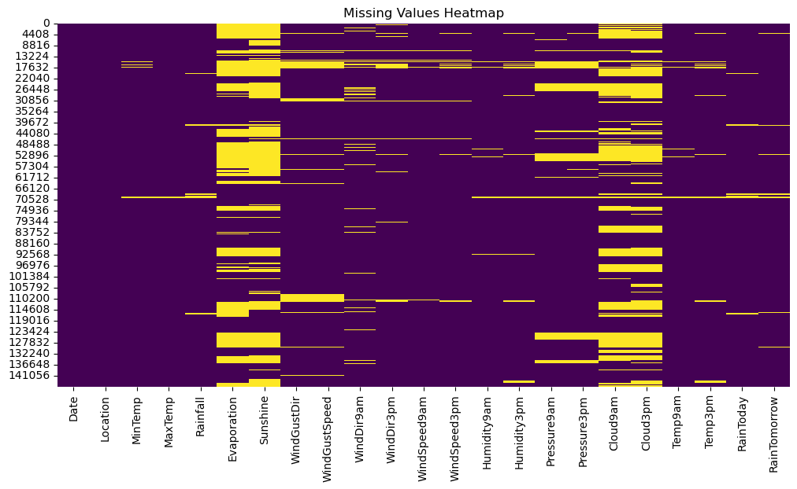
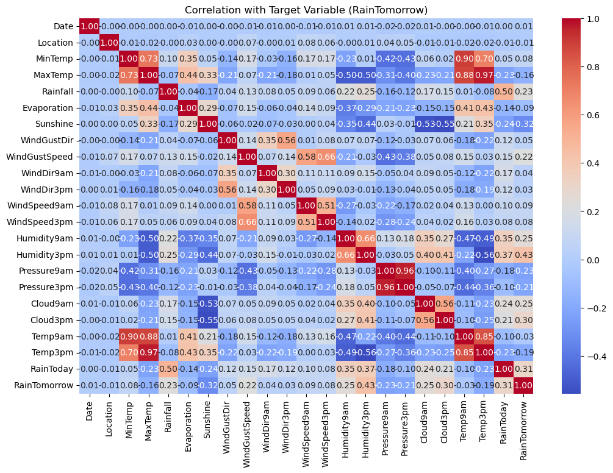
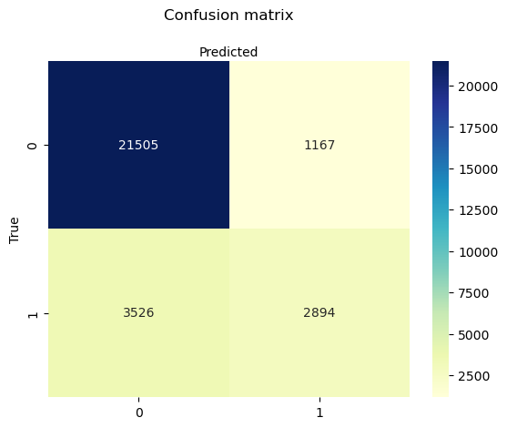
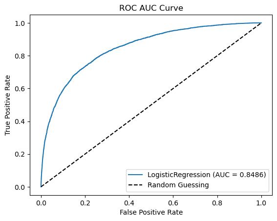

# Machine Learning Concepts

Machine learning is a field of study that enables computers to learn and improve from experience without being explicitly programmed. It focuses on developing computer programs that can access data and use it to learn for themselves

## Types of ML Algorithms

Types of Machine Learning
There are three main categories of machine learning algorithms:

- Supervised Learning: Algorithms learn from labeled training data to predict outcomes. It includes classification (predicting categories) and regression (predicting numerical values).
- Unsupervised Learning: Algorithms find hidden patterns in unlabeled data. A common task is clustering, which groups similar examples together.
- Reinforcement Learning: Algorithms learn by interacting with an environment and receiving rewards or penalties for actions to maximize performance

## Preprocessing

Data preprocessing describes the steps needed to encode data with the purpose of transforming it into a numerical state that machines can read. Data preprocessing techniques are part of data mining, which creates end products out of raw data which is standardized/normalized, contains no null values, and more.

### Replacing Null Values 

Replacing null values is usually the most common of data preprocessing techniques because it allows us to have a full dataset of values to work with. To execute replacing null values as part of data preprocessing, I suggest using Google Colab or opening a Jupyter notebook. For simplicity’s sake, I will be using Google Colab. Your first step will be to import `SimpleImputer` which is part of the `sklearn` library. The SimpleImputer class provides basic strategies for imputing, or representing missing values.

~~~
from sklearn.impute import SimpleImputer
~~~
{: python}

Next, you’re going to want to specify which missing values to replace. We will be replacing those missing values with the mean of that row of the dataset, which we can do by setting the strategy variable equal to the mean.

~~~
imputer = SimpleImputer(missing_values=np.nan, strategy='mean')
~~~
{: .python}

The imputer fills missing values with some statistics (e.g., mean, median) of the data. To avoid data leakage during cross-validation, it computes the statistic on the train data during the fit and then stores it. It then uses that data on the test portion, done during the transform. 

~~~
imputer.fit(X[:, 1:3]) #looks @ rows and columns X[:, 1:3] = imputer.transform(X[:, 1:3])
~~~
{: .python}

### Feature Scaling

Feature scaling is a data preprocessing technique used to normalize our set of data values. The reason we use feature scaling is that some sets of data might be overtaken by others in such a way that the machine learning model disregards the overtaken data. The sets of data, in this case, represent separate features.

Normalization puts all values between 0 and 1. However, normalization is a recommended data preprocessing technique when most of your features exhibit a normal distribution – which may not always be the case.

## Evaluation Metrics and Model Selection

## Supervised Learning

### Regression

### Classification

Classification, a cornerstone of supervised learning, is invaluable in physical sciences for predicting categorical labels from historical data. Examples of such problem in physical sciences are:
1. Binary: Distinguishing healthy from diseased cells in medical images.
2. Multiclass: Classifying galaxy types based on their features in astronomy.
3. Multilabel: Identifying multiple geological formations in satellite images in geology.

Example: Weather Pattern Classification in Climate Science
Objective: Predict tomorrow's weather type (e.g., sunny, cloudy, rainy, snowy) from historical weather data.

Dataset:
- Features: Temperature, humidity, wind speed, atmospheric pressure, past weather.
- Labels: Weather types.

Our training explores various classification methods, focusing on predicting weather patterns to enhance understanding in physical sciences. Let's start with importing libraries and 

~~~
import numpy as np
import pandas as pd
data = pd.read_csv('weatherAUS.csv')
data.head()
~~~
{: .python}

~~~
Date	Location	MinTemp	MaxTemp	Rainfall	Evaporation	Sunshine	WindGustDir	WindGustSpeed	WindDir9am	...	Humidity9am	Humidity3pm	Pressure9am	Pressure3pm	Cloud9am	Cloud3pm	Temp9am	Temp3pm	RainToday	RainTomorrow
0	01-12-2008	Albury	13.4	22.9	0.6	NaN	NaN	W	44.0	W	...	71.0	22.0	1007.7	1007.1	8.0	NaN	16.9	21.8	No	No
1	02-12-2008	Albury	7.4	25.1	0.0	NaN	NaN	WNW	44.0	NNW	...	44.0	25.0	1010.6	1007.8	NaN	NaN	17.2	24.3	No	No
2	03-12-2008	Albury	12.9	25.7	0.0	NaN	NaN	WSW	46.0	W	...	38.0	30.0	1007.6	1008.7	NaN	2.0	21.0	23.2	No	No
3	04-12-2008	Albury	9.2	28.0	0.0	NaN	NaN	NE	24.0	SE	...	45.0	16.0	1017.6	1012.8	NaN	NaN	18.1	26.5	No	No
4	05-12-2008	Albury	17.5	32.3	1.0	NaN	NaN	W	41.0	ENE	...	82.0	33.0	1010.8	1006.0	7.0	8.0	17.8	29.7	No	No
5 rows × 23 columns
~~~
{: .output}

> ## Excercise: Data type info and non-null counts
>  - write a code in Pandas to print the df info of the dataframe
> > # Solution 
> > ~~~
> > df.info()
> > ~~~
> > {: .python}
> > ~~~
> > <class 'pandas.core.frame.DataFrame'>
> > RangeIndex: 145460 entries, 0 to 145459
> > Data columns (total 23 columns):
> >  #   Column         Non-Null Count   Dtype  
> > ---  ------         --------------   -----  
> > 0   Date           145460 non-null  object 
> > 1   Location       145460 non-null  object 
> > 2   MinTemp        143975 non-null  float64
> > 3   MaxTemp        144199 non-null  float64
> > 4   Rainfall       142199 non-null  float64
> > 5   Evaporation    82670 non-null   float64
> > 6   Sunshine       75625 non-null   float64
> > 7   WindGustDir    135134 non-null  object 
> > 8   WindGustSpeed  135197 non-null  float64
> > 9   WindDir9am     134894 non-null  object 
> > 10  WindDir3pm     141232 non-null  object 
> > 11  WindSpeed9am   143693 non-null  float64
> > 12  WindSpeed3pm   142398 non-null  float64
> > 13  Humidity9am    142806 non-null  float64
> > 14  Humidity3pm    140953 non-null  float64
> > 15  Pressure9am    130395 non-null  float64
> > 16  Pressure3pm    130432 non-null  float64
> > 17  Cloud9am       89572 non-null   float64
> > 18  Cloud3pm       86102 non-null   float64
> > 19  Temp9am        143693 non-null  float64
> > 20  Temp3pm        141851 non-null  float64
> > 21  RainToday      142199 non-null  object 
> > 22  RainTomorrow   142193 non-null  object 
> > dtypes: float64(16), object(7)
> > memory usage: 25.5+ MB
> > {: .output}
> {: .solution}
{: .challenge}

### 4. Pre-Processing
When applying any predictive algorithm, we can never use it immediately without having done any pre-processing of the data. This step is extremely important, and can never be overlooked. For this data set, we perform the following pre-processing steps:

* Drop features that do not seem to add any value to our model
To determine which columns are less important for predicting the target variable RainTomorrow, we need to consider several factors:

a. **Missing Values**: Columns with a high proportion of missing values might be less useful unless they carry significant predictive power that justifies the effort to handle these missing values.

b. **Correlation with Target**: Columns with little or no correlation to the target variable might be less important.

c. **Domain Knowledge**: Certain features might be more relevant based on domain knowledge about weather prediction.

**Calculate missing value percentages for all columns**

~~~
data.isnull().sum()
~~~
{: .python}

~~~
Date                 0
Location             0
MinTemp           1485
MaxTemp           1261
Rainfall          3261
Evaporation      62790
Sunshine         69835
WindGustDir      10326
WindGustSpeed    10263
WindDir9am       10566
WindDir3pm        4228
WindSpeed9am      1767
WindSpeed3pm      3062
Humidity9am       2654
Humidity3pm       4507
Pressure9am      15065
Pressure3pm      15028
Cloud9am         55888
Cloud3pm         59358
Temp9am           1767
Temp3pm           3609
RainToday         3261
RainTomorrow      3267
dtype: int64
~~~
{: .output}
~~~
# Calculate missing value percentages for all columns
missing_percentages = (data.isnull().sum() / len(data)) * 100

# Display missing value percentages for all columns
print("Missing value percentages for all columns:")
print(missing_percentages)
~~~
{: .python}

~~~
Missing value percentages for all columns:
Date              0.000000
Location          0.000000
MinTemp           1.020899
MaxTemp           0.866905
Rainfall          2.241853
Evaporation      43.166506
Sunshine         48.009762
WindGustDir       7.098859
WindGustSpeed     7.055548
WindDir9am        7.263853
WindDir3pm        2.906641
WindSpeed9am      1.214767
WindSpeed3pm      2.105046
Humidity9am       1.824557
Humidity3pm       3.098446
Pressure9am      10.356799
Pressure3pm      10.331363
Cloud9am         38.421559
Cloud3pm         40.807095
Temp9am           1.214767
Temp3pm           2.481094
RainToday         2.241853
RainTomorrow      2.245978
dtype: float64
~~~
{: .output}

Columns with a high percentage of missing values are likely to be less important unless they have a strong correlation with the target.

- Evaporation (missing 42.82%): Likely less important.
- Sunshine (missing 48.02%): Likely less important.
- Cloud9am (missing 38.42%): Possibly less important.
- Cloud3pm (missing 40.79%): Possibly less important.
~~~
#Visualize missing values
import seaborn as sns
import matplotlib.pyplot as plt
import seaborn as sns
plt.figure(figsize=(12, 6))
sns.heatmap(data.isnull(), cbar=False, cmap='viridis')
plt.title('Missing Values Heatmap')
plt.show()
~~~
{: .python}

{: .output}
**Get the data types of all columns**
~~~
# Get the data types of all columns
column_data_types = data.dtypes

# Separate columns into numerical and categorical
numerical_columns = column_data_types[column_data_types != 'object'].index.tolist()
categorical_columns = column_data_types[column_data_types == 'object'].index.tolist()

# Print the lists of numerical and categorical columns
print("Numerical columns:", numerical_columns)
print("Categorical columns:", categorical_columns)
~~~
{: .python}

~~~
Numerical columns: ['MinTemp', 'MaxTemp', 'Rainfall', 'Evaporation', 'Sunshine', 'WindGustSpeed', 'WindSpeed9am', 'WindSpeed3pm', 'Humidity9am', 'Humidity3pm', 'Pressure9am', 'Pressure3pm', 'Cloud9am', 'Cloud3pm', 'Temp9am', 'Temp3pm']
Categorical columns: ['Date', 'Location', 'WindGustDir', 'WindDir9am', 'WindDir3pm', 'RainToday', 'RainTomorrow']
~~~
{: .output}

#### 5. Replace missing values
~~~
from sklearn.impute import SimpleImputer
# Assuming df is your DataFrame

# Numerical columns
numerical_cols = ['MinTemp', 'MaxTemp', 'Rainfall', 'Evaporation', 'Sunshine', 'WindGustSpeed', 'WindSpeed9am', 'WindSpeed3pm', 'Humidity9am', 'Humidity3pm', 'Pressure9am', 'Pressure3pm', 'Cloud9am', 'Cloud3pm', 'Temp9am', 'Temp3pm']

# Categorical columns
categorical_cols = ['Date', 'Location', 'WindGustDir', 'WindDir9am', 'WindDir3pm', 'RainToday', 'RainTomorrow']

# Impute numerical columns with mean
num_imputer = SimpleImputer(strategy='mean')
data[numerical_cols] = num_imputer.fit_transform(data[numerical_cols])

# Impute categorical columns with the most frequent value
cat_imputer = SimpleImputer(strategy='most_frequent')
data[categorical_cols] = cat_imputer.fit_transform(data[categorical_cols])

print(data.head())
~~~
{: .python}

~~~
         Date Location  MinTemp  MaxTemp  Rainfall  Evaporation  Sunshine  \
0  01-12-2008   Albury     13.4     22.9       0.6     5.468232  7.611178   
1  02-12-2008   Albury      7.4     25.1       0.0     5.468232  7.611178   
2  03-12-2008   Albury     12.9     25.7       0.0     5.468232  7.611178   
3  04-12-2008   Albury      9.2     28.0       0.0     5.468232  7.611178   
4  05-12-2008   Albury     17.5     32.3       1.0     5.468232  7.611178   

  WindGustDir  WindGustSpeed WindDir9am  ... Humidity9am  Humidity3pm  \
0           W           44.0          W  ...        71.0         22.0   
1         WNW           44.0        NNW  ...        44.0         25.0   
2         WSW           46.0          W  ...        38.0         30.0   
3          NE           24.0         SE  ...        45.0         16.0   
4           W           41.0        ENE  ...        82.0         33.0   

   Pressure9am  Pressure3pm  Cloud9am  Cloud3pm  Temp9am  Temp3pm  RainToday  \
0       1007.7       1007.1  8.000000   4.50993     16.9     21.8         No   
1       1010.6       1007.8  4.447461   4.50993     17.2     24.3         No   
2       1007.6       1008.7  4.447461   2.00000     21.0     23.2         No   
3       1017.6       1012.8  4.447461   4.50993     18.1     26.5         No   
4       1010.8       1006.0  7.000000   8.00000     17.8     29.7         No   

   RainTomorrow  
0            No  
1            No  
2            No  
3            No  
4            No  

[5 rows x 23 columns]
~~~
{: .output}

~~~
data.isnull().sum()
~~~
{: .python}

~~~
Date             0
Location         0
MinTemp          0
MaxTemp          0
Rainfall         0
Evaporation      0
Sunshine         0
WindGustDir      0
WindGustSpeed    0
WindDir9am       0
WindDir3pm       0
WindSpeed9am     0
WindSpeed3pm     0
Humidity9am      0
Humidity3pm      0
Pressure9am      0
Pressure3pm      0
Cloud9am         0
Cloud3pm         0
Temp9am          0
Temp3pm          0
RainToday        0
RainTomorrow     0
dtype: int64
~~~
{: .output}

###### Data Encoding
Data encoding is a process of transforming categorical data into a numerical format suitable for analysis by machine learning algorithms. Categorical data consists of discrete labels, such as colors, types, or categories, which are not inherently numerical. Two common encoding techniques are Label Encoding and One-Hot Encoding.

**Label Encoding**:

* Method: In label encoding, each unique category is assigned a unique integer label.
* Example: If we have categories like 'Red,' 'Green,' and 'Blue,' label encoding might assign them labels 0, 1, and 2, respectively.
* Use Case: Label encoding is often used when there is an ordinal relationship between categories, meaning there is a meaningful order or ranking among them.

**One-Hot Encoding**:

* Method: One-hot encoding creates binary columns for each category and indicates the presence or absence of the category with a 1 or 0, respectively.
* Example: For the categories 'Red,' 'Green,' and 'Blue,' one-hot encoding would create three binary columns, each representing one color, with values like [1, 0, 0] for 'Red,' [0, 1, 0] for 'Green,' and [0, 0, 1] for 'Blue.'
* Use Case: One-hot encoding is commonly used when there is no inherent order among categories, and each category is considered equally distinct.

**Considerations**:

* Label encoding might introduce unintended ordinal relationships in the data, which can be problematic for some algorithms.
* One-hot encoding avoids this issue by representing categories independently, but it can lead to a large number of features, especially when dealing with a high number of categories.
* The choice between label encoding and one-hot encoding depends on the nature of the data and the requirements of the machine learning algorithm being used.

**Application**:

* Data encoding is crucial when working with machine learning models that require numerical input, such as linear regression, support vector machines, or neural networks.
* Many machine learning libraries and frameworks provide convenient functions for implementing these encoding techniques.

~~~
from sklearn.preprocessing import LabelEncoder

# Create an instance of LabelEncoder
label_encoder = LabelEncoder()

# Encode categoricalencode categorical data into numerical data  columns
for column in categorical_cols:
    data[column] = label_encoder.fit_transform(data[column])

# Print the first few rows to verify encoding
print(data.head())
~~~
{: .python}

~~~
 Date  Location  MinTemp  MaxTemp  Rainfall  Evaporation  Sunshine  \
0   105         2     13.4     22.9       0.6     5.468232  7.611178   
1   218         2      7.4     25.1       0.0     5.468232  7.611178   
2   331         2     12.9     25.7       0.0     5.468232  7.611178   
3   444         2      9.2     28.0       0.0     5.468232  7.611178   
4   557         2     17.5     32.3       1.0     5.468232  7.611178   

   WindGustDir  WindGustSpeed  WindDir9am  ...  Humidity9am  Humidity3pm  \
0           13           44.0          13  ...         71.0         22.0   
1           14           44.0           6  ...         44.0         25.0   
2           15           46.0          13  ...         38.0         30.0   
3            4           24.0           9  ...         45.0         16.0   
4           13           41.0           1  ...         82.0         33.0   

   Pressure9am  Pressure3pm  Cloud9am  Cloud3pm  Temp9am  Temp3pm  RainToday  \
0       1007.7       1007.1  8.000000   4.50993     16.9     21.8          0   
1       1010.6       1007.8  4.447461   4.50993     17.2     24.3          0   
2       1007.6       1008.7  4.447461   2.00000     21.0     23.2          0   
3       1017.6       1012.8  4.447461   4.50993     18.1     26.5          0   
4       1010.8       1006.0  7.000000   8.00000     17.8     29.7          0   

   RainTomorrow  
0             0  
1             0  
2             0  
3             0  
4             0  

[5 rows x 23 columns]
~~~
{: .output}

**Correlation with Target**
* Calculate the correlation of numerical features with RainTomorrow. For categorical features, we can use other methods like Chi-square test for independence or converting them to numerical and checking correlation.

~~~
# Calculate correlation of each numerical feature with the target variable
correlation_with_target = data.corr()['RainTomorrow'].sort_values(ascending=False)

# Print correlation values
print(correlation_with_target)
~~~
{: .python}

~~~
RainTomorrow     1.000000
Humidity3pm      0.433179
RainToday        0.305744
Cloud3pm         0.298050
Humidity9am      0.251470
Cloud9am         0.249978
Rainfall         0.233900
WindGustSpeed    0.220442
WindSpeed9am     0.086661
WindSpeed3pm     0.084207
MinTemp          0.082173
WindGustDir      0.048774
WindDir9am       0.035341
WindDir3pm       0.028890
Date             0.005732
Location        -0.005498
Temp9am         -0.025555
Evaporation     -0.088288
MaxTemp         -0.156851
Temp3pm         -0.187806
Pressure3pm     -0.211977
Pressure9am     -0.230975
Sunshine        -0.321533
Name: RainTomorrow, dtype: float64
~~~
{: .output}

~~~
correlation_matrix = data.corr()
plt.figure(figsize=(12, 8))
sns.heatmap(correlation_matrix, annot=True, cmap='coolwarm', fmt=".2f")
plt.title('Correlation with Target Variable (RainTomorrow)')
plt.show()
~~~
{: .python}

~~~
data
~~~
{: .python}

~~~
	Date	Location	MinTemp	MaxTemp	Rainfall	Evaporation	Sunshine	WindGustDir	WindGustSpeed	WindDir9am	...	Humidity9am	Humidity3pm	Pressure9am	Pressure3pm	Cloud9am	Cloud3pm	Temp9am	Temp3pm	RainToday	RainTomorrow
0	105	2	13.4	22.900000	0.6	5.468232	7.611178	13	44.00000	13	...	71.0	22.0	1007.7	1007.1	8.000000	4.50993	16.9	21.8	0	0
1	218	2	7.4	25.100000	0.0	5.468232	7.611178	14	44.00000	6	...	44.0	25.0	1010.6	1007.8	4.447461	4.50993	17.2	24.3	0	0
2	331	2	12.9	25.700000	0.0	5.468232	7.611178	15	46.00000	13	...	38.0	30.0	1007.6	1008.7	4.447461	2.00000	21.0	23.2	0	0
3	444	2	9.2	28.000000	0.0	5.468232	7.611178	4	24.00000	9	...	45.0	16.0	1017.6	1012.8	4.447461	4.50993	18.1	26.5	0	0
4	557	2	17.5	32.300000	1.0	5.468232	7.611178	13	41.00000	1	...	82.0	33.0	1010.8	1006.0	7.000000	8.00000	17.8	29.7	0	0
...	...	...	...	...	...	...	...	...	...	...	...	...	...	...	...	...	...	...	...	...	...
145455	2317	41	2.8	23.400000	0.0	5.468232	7.611178	0	31.00000	9	...	51.0	24.0	1024.6	1020.3	4.447461	4.50993	10.1	22.4	0	0
145456	2430	41	3.6	25.300000	0.0	5.468232	7.611178	6	22.00000	9	...	56.0	21.0	1023.5	1019.1	4.447461	4.50993	10.9	24.5	0	0
145457	2543	41	5.4	26.900000	0.0	5.468232	7.611178	3	37.00000	9	...	53.0	24.0	1021.0	1016.8	4.447461	4.50993	12.5	26.1	0	0
145458	2656	41	7.8	27.000000	0.0	5.468232	7.611178	9	28.00000	10	...	51.0	24.0	1019.4	1016.5	3.000000	2.00000	15.1	26.0	0	0
145459	2769	41	14.9	23.221348	0.0	5.468232	7.611178	13	40.03523	2	...	62.0	36.0	1020.2	1017.9	8.000000	8.00000	15.0	20.9	0	0
145460 rows × 23 columns
~~~
{: .output}
* Based on the parsentage of the missing value let us drop the following features
~~~
data.drop(['Evaporation', 'Sunshine','Cloud9am','Cloud3pm'], axis=1, inplace=True)
data
~~~
{: .python}

~~~
	Date	Location	MinTemp	MaxTemp	Rainfall	WindGustDir	WindGustSpeed	WindDir9am	WindDir3pm	WindSpeed9am	WindSpeed3pm	Humidity9am	Humidity3pm	Pressure9am	Pressure3pm	Temp9am	Temp3pm	RainToday	RainTomorrow
0	105	2	13.4	22.900000	0.6	13	44.00000	13	14	20.0	24.0	71.0	22.0	1007.7	1007.1	16.9	21.8	0	0
1	218	2	7.4	25.100000	0.0	14	44.00000	6	15	4.0	22.0	44.0	25.0	1010.6	1007.8	17.2	24.3	0	0
2	331	2	12.9	25.700000	0.0	15	46.00000	13	15	19.0	26.0	38.0	30.0	1007.6	1008.7	21.0	23.2	0	0
3	444	2	9.2	28.000000	0.0	4	24.00000	9	0	11.0	9.0	45.0	16.0	1017.6	1012.8	18.1	26.5	0	0
4	557	2	17.5	32.300000	1.0	13	41.00000	1	7	7.0	20.0	82.0	33.0	1010.8	1006.0	17.8	29.7	0	0
...	...	...	...	...	...	...	...	...	...	...	...	...	...	...	...	...	...	...	...
145455	2317	41	2.8	23.400000	0.0	0	31.00000	9	1	13.0	11.0	51.0	24.0	1024.6	1020.3	10.1	22.4	0	0
145456	2430	41	3.6	25.300000	0.0	6	22.00000	9	3	13.0	9.0	56.0	21.0	1023.5	1019.1	10.9	24.5	0	0
145457	2543	41	5.4	26.900000	0.0	3	37.00000	9	14	9.0	9.0	53.0	24.0	1021.0	1016.8	12.5	26.1	0	0
145458	2656	41	7.8	27.000000	0.0	9	28.00000	10	3	13.0	7.0	51.0	24.0	1019.4	1016.5	15.1	26.0	0	0
145459	2769	41	14.9	23.221348	0.0	13	40.03523	2	2	17.0	17.0	62.0	36.0	1020.2	1017.9	15.0	20.9	0	0
145460 rows × 19 columns
~~~
{: .output}
* Let us assign the features and target values for further analysis or modeling
~~~
y = data.RainTomorrow.copy()
X = data.drop(['RainTomorrow', 'Date'], axis=1)
~~~
{: .python}
~~~
print(X)
~~~
{: .python}
~~~
        Location  MinTemp    MaxTemp  Rainfall  WindGustDir  WindGustSpeed  \
0              2     13.4  22.900000       0.6           13       44.00000   
1              2      7.4  25.100000       0.0           14       44.00000   
2              2     12.9  25.700000       0.0           15       46.00000   
3              2      9.2  28.000000       0.0            4       24.00000   
4              2     17.5  32.300000       1.0           13       41.00000   
...          ...      ...        ...       ...          ...            ...   
145455        41      2.8  23.400000       0.0            0       31.00000   
145456        41      3.6  25.300000       0.0            6       22.00000   
145457        41      5.4  26.900000       0.0            3       37.00000   
145458        41      7.8  27.000000       0.0            9       28.00000   
145459        41     14.9  23.221348       0.0           13       40.03523   

        WindDir9am  WindDir3pm  WindSpeed9am  WindSpeed3pm  Humidity9am  \
0               13          14          20.0          24.0         71.0   
1                6          15           4.0          22.0         44.0   
2               13          15          19.0          26.0         38.0   
3                9           0          11.0           9.0         45.0   
4                1           7           7.0          20.0         82.0   
...            ...         ...           ...           ...          ...   
145455           9           1          13.0          11.0         51.0   
145456           9           3          13.0           9.0         56.0   
145457           9          14           9.0           9.0         53.0   
145458          10           3          13.0           7.0         51.0   
145459           2           2          17.0          17.0         62.0   

        Humidity3pm  Pressure9am  Pressure3pm  Temp9am  Temp3pm  RainToday  
0              22.0       1007.7       1007.1     16.9     21.8          0  
1              25.0       1010.6       1007.8     17.2     24.3          0  
2              30.0       1007.6       1008.7     21.0     23.2          0  
3              16.0       1017.6       1012.8     18.1     26.5          0  
4              33.0       1010.8       1006.0     17.8     29.7          0  
...             ...          ...          ...      ...      ...        ...  
145455         24.0       1024.6       1020.3     10.1     22.4          0  
145456         21.0       1023.5       1019.1     10.9     24.5          0  
145457         24.0       1021.0       1016.8     12.5     26.1          0  
145458         24.0       1019.4       1016.5     15.1     26.0          0  
145459         36.0       1020.2       1017.9     15.0     20.9          0  

[145460 rows x 17 columns]
~~~
{: .output}

~~~
print(y)
~~~
{: .python}

~~~
0         0
1         0
2         0
3         0
4         0
         ..
145455    0
145456    0
145457    0
145458    0
145459    0
Name: RainTomorrow, Length: 145460, dtype: int32
~~~
{: .output}
#### Feature Scaling/ Data normalization

Data normalization is a preprocessing technique used in data analysis and machine learning to scale and transform the features of a dataset. The goal is to bring the values of different features to a similar scale, preventing certain features from dominating the others due to their inherent magnitude. This process aids in improving the performance of algorithms, especially those sensitive to the scale of input features. Here are the key aspects of data normalization:

1. **Scale Consistency:**
   - Features in a dataset often have different units and ranges. Normalization ensures that all features are on a consistent scale, making it easier to compare and analyze them.

2. **Preventing Dominance:**
   - In models that use distance-based metrics (e.g., k-nearest neighbors, clustering algorithms), features with larger scales may dominate the influence, leading to biased results. Normalization mitigates this issue.

3. **Algorithm Sensitivity:**
   - Many machine learning algorithms, such as gradient-based optimization methods (e.g., gradient descent), are sensitive to the scale of input features. Normalizing the data helps algorithms converge faster and perform more reliably.

4. **Standardization vs. Min-Max Scaling:**
   - Two common normalization techniques are standardization and min-max scaling.
      - **Standardization (Z-score normalization):** It transforms data to have a mean of 0 and a standard deviation of 1. The formula is $z = \frac{(x - \mu)}{\sigma}$, where $x$ is the original value, $\mu$ is the mean, and $\sigma$ is the standard deviation.
      - **Min-Max Scaling:** It scales data to a specific range, often between 0 and 1. The formula is $x_{\text{scaled}} = \frac{(x - \text{min})}{(\text{max} - \text{min})}$.

5. **Applicability:**
   - The choice between standardization and min-max scaling depends on the characteristics of the data and the requirements of the algorithm. Standardization is less affected by outliers, making it suitable for robustness against extreme values.

~~~
from sklearn.preprocessing import StandardScaler
sc = StandardScaler()
X = sc.fit_transform(X)
print(X)
~~~
{: .python}

~~~
[[-1.53166617e+00  1.89446615e-01 -4.53363105e-02 ... -1.40531282e-02
   1.70232282e-02 -5.29795450e-01]
 [-1.53166617e+00 -7.53100728e-01  2.65043084e-01 ...  3.24642790e-02
   3.81984952e-01 -5.29795450e-01]
 [-1.53166617e+00  1.10901003e-01  3.49692009e-01 ...  6.21684769e-01
   2.21401794e-01 -5.29795450e-01]
 ...
 [ 1.20928479e+00 -1.06728318e+00  5.18989861e-01 ... -6.96308433e-01
   6.44757393e-01 -5.29795450e-01]
 [ 1.20928479e+00 -6.90264238e-01  5.33098015e-01 ... -2.93157571e-01
   6.30158924e-01 -5.29795450e-01]
 [ 1.20928479e+00  4.25083451e-01 -5.01222327e-16 ... -3.08663373e-01
  -1.14362992e-01 -5.29795450e-01]]
~~~
{: .output}

## Splitting Dataset into Training set and Test set

* Splitting a dataset into training and test sets is a fundamental step in machine learning to evaluate the performance of a model. The training set is used to train the model, while the test set is used to evaluate its performance on unseen data. Here's how you can split a dataset into training and test sets in Python:
~~~
from sklearn.model_selection import train_test_split
X_train, X_test, y_train, y_test = train_test_split(X, y, test_size=0.2, random_state=42)
print(X_train)
~~~
{: .python}

~~~
[[-1.60194696e+00  3.62246961e-01 -7.64852179e-01 ... -1.22593745e-01
  -5.18641804e-16  1.88752093e+00]
 [-5.47735053e-01  1.94886832e+00  2.29661730e+00 ...  2.03271279e+00
   2.55715683e+00 -5.29795450e-01]
 [-3.36892671e-01  3.93665206e-01  4.76665398e-01 ...  4.79700813e-02
   4.11181890e-01 -5.29795450e-01]
 ...
 [ 2.95634473e-01 -7.21682483e-01 -2.14634162e-01 ... -5.10238804e-01
  -7.05675855e-02 -5.29795450e-01]
 [-6.18015846e-01 -5.33173014e-01 -1.18809681e+00 ... -4.48215595e-01
  -1.18005123e+00 -5.29795450e-01]
 [ 5.06476854e-01  5.66465552e-01  2.45180700e+00 ...  2.03271279e+00
   1.78343797e+00 -5.29795450e-01]]
~~~
{: .output}
## Training Model
## 1. Logistic Regression
1. **Logistic Regression** is used to model the probability that a given input belongs to a particular class. It's commonly used when the dependent variable is binary (0/1, True/False, Yes/No), but it can also be extended to handle multiclass classification tasks.

2. **How it Works**
Model: Logistic Regression models the relationship between the independent variables (features) and the probability of a binary outcome using the logistic function (sigmoid function).
Sigmoid Function: The sigmoid function maps any real-valued number to the range [0, 1], which makes it suitable for modeling probabilities.
Hypothesis: The logistic regression hypothesis can be represented as:

hθ(x) = g(θ^T x)

where: hθ(x) is the predicted probability that y = 1 given x. 
g(z) is the sigmoid function, g(z) = \frac{1}{1 + e^{-z}}

\theta^T   is the transpose of the parameter vector.
𝑥  is the feature vector.

**3. Training Process**

* **Cost Function**: Logistic Regression uses the logistic loss (or cross-entropy loss) as the cost function to penalize incorrect predictions.
* **Optimization**: The model parameters (θ) are learned by minimizing the cost function using optimization algorithms like gradient descent.

**4. Model Interpretation**
* **Coefficients**: The coefficients (θ) learned by Logistic Regression represent the impact of each feature on the predicted probability of the positive class.
* **Interpretation**: Positive coefficients indicate that an increase in the corresponding feature value increases the probability of the positive class, while negative coefficients indicate the opposite.

**5. Applications**
* **Binary Classification**: Predicting whether an email is spam or not, whether a patient has a disease or not.
* Probability Estimation**: Estimating the probability of a customer buying a product or defaulting on a loan.

~~~
import pandas as pd
import matplotlib.pyplot as plt
import seaborn as sns
import numpy as np
from sklearn.metrics import accuracy_score, precision_score, recall_score, f1_score
from sklearn.metrics import confusion_matrix
from sklearn.linear_model import LogisticRegression
from sklearn.model_selection import train_test_split
~~~
{: .python}

~~~
model = LogisticRegression(solver='liblinear')
model.fit(X_train, y_train)
~~~
{: .python}

~~~
y_pred = pd.Series(model.predict(X_test))

y_test = y_test.reset_index(drop=True)
z = pd.concat([y_test, y_pred], axis=1)
z.columns = ['True', 'Prediction']
z.head(50)
~~~
{: .python}

~~~
	True	Prediction
0	1	1
1	0	0
2	0	0
3	0	0
4	0	0
5	0	0
6	0	0
7	1	0
8	0	0
9	1	1
10	0	0
11	0	0
12	0	0
13	0	0
14	0	0
15	1	0
16	1	1
17	0	0
18	1	0
19	0	0
20	0	0
21	0	0
22	0	0
23	1	1
24	0	0
25	0	0
26	0	0
27	1	1
28	1	0
29	0	0
30	0	0
31	0	0
32	0	0
33	0	0
34	0	0
35	1	0
36	0	0
37	1	1
38	0	0
39	0	0
40	0	0
41	1	1
42	0	0
43	0	0
44	0	0
45	0	0
46	0	0
47	1	1
48	1	0
49	0	0
~~~
{: .output}
~~~
from sklearn.metrics import accuracy_score, precision_score, recall_score, f1_score

print("Accuracy:", accuracy_score(y_test, y_pred))
print("Precision:", precision_score(y_test, y_pred))
print("Recall:", recall_score(y_test, y_pred))
print("F1-Score:",f1_score(y_test, y_pred))
~~~
{: .python}

~~~
Accuracy: 0.8386841743434621
Precision: 0.7126323565624231
Recall: 0.45077881619937693
F1-Score: 0.5522373819292052
~~~
{: .output}

~~~
cnf_matrix = confusion_matrix(y_test, y_pred)

labels = [0, 1]
fig, ax = plt.subplots()
tick_marks = np.arange(len(labels))
plt.xticks(tick_marks, labels)
plt.yticks(tick_marks, labels)
# create heatmap
sns.heatmap(pd.DataFrame(cnf_matrix), annot=True, cmap="YlGnBu", fmt='g')
ax.xaxis.set_label_position("top")
plt.title('Confusion matrix', y=1.1)
plt.ylabel('True')
plt.xlabel('Predicted')
~~~
{: .python}

~~~
from sklearn.metrics import accuracy_score, precision_score, recall_score, f1_score, confusion_matrix, classification_report, roc_curve, auc
#Calculate and plot the ROC AUC curve of the model
y_score = model.predict_proba(X_test)[:,1]
fpr, tpr, _ = roc_curve(y_test, y_score)
roc_auc = auc(fpr, tpr)
plt.plot(fpr, tpr, label='{} (AUC = {:.4f})'.format(model.__class__.__name__, roc_auc))

# Plot the ROC AUC curve for the logistic regression model
plt.plot([0, 1], [0, 1], 'k--', label='Random Guessing')
plt.xlabel('False Positive Rate')
plt.ylabel('True Positive Rate')
plt.title('ROC AUC Curve')
plt.legend(loc='lower right')
plt.show();
~~~
{: .python}

~~~

~~~
{: .output}

# Random Forest

~~~
from sklearn.ensemble import RandomForestClassifier
classifier = RandomForestClassifier(n_estimators=100, random_state=0)
classifier.fit(X_train, y_train)
~~~
{: .python}

~~~
y_pred = pd.Series(model.predict(X_test))

y_test = y_test.reset_index(drop=True)
z = pd.concat([y_test, y_pred], axis=1)
z.columns = ['True', 'Prediction']
z.head(50)
~~~
{: .python}

~~~
	True	Prediction
0	1	1
1	0	0
2	0	0
3	0	0
4	0	0
5	0	0
6	0	0
7	1	0
8	0	0
9	1	1
10	0	0
11	0	0
12	0	0
13	0	0
14	0	0
15	1	0
16	1	1
17	0	0
18	1	0
19	0	0
20	0	0
21	0	0
22	0	0
23	1	1
24	0	0
25	0	0
26	0	0
27	1	1
28	1	0
29	0	0
30	0	0
31	0	0
32	0	0
33	0	0
34	0	0
35	1	0
36	0	0
37	1	1
38	0	0
39	0	0
40	0	0
41	1	1
42	0	0
43	0	0
44	0	0
45	0	0
46	0	0
47	1	1
48	1	0
49	0	0
~~~
{: .output}

~~~
print("Accuracy:", accuracy_score(y_test, y_pred))
print("Precision:", precision_score(y_test, y_pred))
print("Recall:", recall_score(y_test, y_pred))
print("F1-Score:",f1_score(y_test, y_pred))
~~~
{: .python}

~~~
Accuracy: 0.8386841743434621
Precision: 0.7126323565624231
Recall: 0.45077881619937693
F1-Score: 0.5522373819292052
~~~
{: .output}

~~~
~~~
{: .python}

~~~
~~~
{: .output}

### Comparison of different models
~~~
from sklearn.model_selection import train_test_split
from sklearn.linear_model import LogisticRegression
from sklearn.tree import DecisionTreeClassifier
from sklearn.ensemble import RandomForestClassifier
from sklearn.svm import SVC
from sklearn.metrics import accuracy_score, precision_score, recall_score, f1_score, confusion_matrix, classification_report, roc_curve, auc
import matplotlib.pyplot as plt
import seaborn as sns

# Split the dataset into training and testing sets
X_train, X_test, y_train, y_test = train_test_split(X, y, test_size=0.2, random_state=42)

# Create a list of classification models to evaluate
models = [LogisticRegression(max_iter=8000), DecisionTreeClassifier(), RandomForestClassifier(), SVC(probability=True)]

# Train and evaluate each model
for model in models:
    # Train the model on the training set
    model.fit(X_train, y_train)

    # Make predictions on the testing set
    y_pred = model.predict(X_test)

    # Calculate and print the classification report of the model
    report = classification_report(y_test, y_pred)
    print(model.__class__.__name__)
    print(report)

 
    # Calculate and plot the ROC AUC curve of the model
    y_score = model.predict_proba(X_test)[:,1]
    fpr, tpr, _ = roc_curve(y_test, y_score)
    roc_auc = auc(fpr, tpr)
    plt.plot(fpr, tpr, label='{} (AUC = {:.4f})'.format(model.__class__.__name__, roc_auc))

    print('-----------------------------------')

# Plot the ROC AUC curves for all models
plt.plot([0, 1], [0, 1], 'k--', label='Random Guessing')
plt.xlabel('False Positive Rate')
plt.ylabel('True Positive Rate')
plt.title('ROC AUC Curve')
plt.legend(loc='lower right')
plt.show();

~~~
{: .python}

~~~
LogisticRegression
              precision    recall  f1-score   support

           0       0.86      0.95      0.90     22672
           1       0.71      0.45      0.55      6420

    accuracy                           0.84     29092
   macro avg       0.79      0.70      0.73     29092
weighted avg       0.83      0.84      0.82     29092

-----------------------------------
DecisionTreeClassifier
              precision    recall  f1-score   support

           0       0.86      0.85      0.86     22672
           1       0.50      0.52      0.51      6420

    accuracy                           0.78     29092
   macro avg       0.68      0.69      0.68     29092
weighted avg       0.78      0.78      0.78     29092

-----------------------------------
RandomForestClassifier
              precision    recall  f1-score   support

           0       0.87      0.95      0.91     22672
           1       0.75      0.48      0.59      6420

    accuracy                           0.85     29092
   macro avg       0.81      0.72      0.75     29092
weighted avg       0.84      0.85      0.84     29092

-----------------------------------
~~~
{: .output}

~~~
~~~
{: .python}

~~~
~~~
{: .output}

~~~
~~~
{: .python}

~~~
~~~
{: .output}

~~~
~~~
{: .python}

~~~
~~~
{: .output}

~~~
~~~
{: .python}

~~~
~~~
{: .output}

~~~
~~~
{: .python}

~~~
~~~
{: .output}

~~~
~~~
{: .python}

~~~
~~~
{: .output}

~~~
~~~
{: .python}

~~~
~~~
{: .output}

~~~
~~~
{: .python}

~~~
~~~
{: .output}

~~~
~~~
{: .python}

~~~
~~~
{: .output}

~~~
~~~
{: .python}

~~~
~~~
{: .output}

~~~
~~~
{: .python}

~~~
~~~
{: .output}

~~~
~~~
{: .python}

~~~
~~~
{: .output}

## Ensemble Learning Techniques

## Unsupervised Learning

## Hyperparameter Tuning and Optimization

