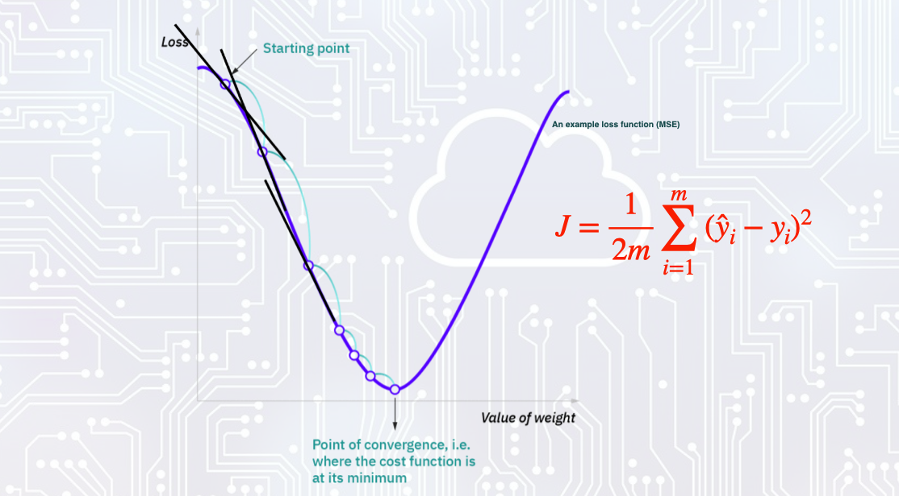

<!-- MathJax -->

<script type="text/javascript"

  src="https://cdnjs.cloudflare.com/ajax/libs/mathjax/2.7.3/MathJax.js?config=TeX-AMS-MML_HTMLorMML">

</script>


 Advances in computational power, experimental techniques, and simulations are producing vast quantities of data across fields like particle physics, cosmology, atomospherica science, materials science, and quantum computing. However, traditional analysis methods struggle to keep up with the scale and complexity of this "big data". Machine learning algorithms excel at finding patterns and making predictions from large, high-dimensional datasets. By training on this wealth of data, ML models can accelerate scientific discovery, optimize experiments, and uncover hidden insights that would be difficult for humans to discern alone. As the pace of data generation continues to outstrip human processing capabilities, machine learning will only grow in importance for driving progress in the physical sciences.


Ultimately, machine learning represents a valuable addition to the climate scientist's toolbox, but should be applied judiciously in conjunction with established physical and statistical methods to gain the most robust insights about the Earth's complex climate system


## ANN


ANNs consists of multiple nodes (the circles) and layers that are all connected and using basic math gives out a result. These are called feed forward networks. 


 In each individual node the values coming in are weighted and summed together and bias term is added and activation. Hence, the linear regression mapping by an activation function to produce non-linear model as shown below:

 \\[ Z = \sigma( W^T \cdot X) \\]


### Activation functions

Activation function determines, if information is moving forward from that specific node.
This is the step that allows for nonlinearity in these algorithms, without activation all we would be doing is linear algebra. Some of the common activation functions are indicated in figure below:


So training of the network is merely determining the weights "w" and bias/offset "b"  with the addition of nonlinear activation function. Goal is to determine the best function so that the output is as  correct as possible; typically involves choosing "weights". 


### Loss Function

You know the data and the goal you're working towards, so you know the best, which loss function to use. Basic MSE or MAE works well for regression tasks. The basic MSE and MAE works well for regression task is given by:


\\[\text{Loss} = \frac{1}{2m} \sum_{i=1}^{m} (\hat{y}_i - y_i)^2\\]


The quantinty you want ot determine("loss") help to determine the best weights and bias terms in the model. Gradient descent is a technique to find the weight that minimizes the loss function.  This is done by starting with a random point, the gradient (the black lines) is calculated at that point. Then the negative of that gradient is followed to the next point and so on. This is repeated until the minimum is reached.




The gradeint descent formula tells us that the next location depends on the negative gradient of J multiplied by the learning rate \\(\lambda\\).

\\[ J_{i+1} = J_{i} - \lambda \nabla J_{t} \\]


As the loss function depends on the linear function and its weights \(w_0\) and \(w_1\), the gradient is calculated as parital derviatives with relation to the weights.


The only other thing one must pay attention to is the learning rate \\(lambda\\) (how big of a step to take). Too small and finding the right weights takes forever, too big and you might miss the minimum.

\\[w_{i+1} = w_i - \lambda \frac{\partial J}{\partial w_i} \\]


Backpropagation is a technique used to compute the gradient of the loss function when its functional form is unknown. This method calculates the gradient with respect to the neural network's weights, allowing for the optimization of these weights to minimize the loss. A critical requirement for the activation functions in this process is that they must be differentiable, as this property is essential for the gradient computation necessary in backpropagation.

Here's the further corrected equation with proper notation and clarity:

\\[
\frac{\partial J}{\partial w_k} = \frac{\partial}{\partial w_k}\left( \frac{1}{2m}\sum_{i=1}^{m}(\hat{y}_i - y_i)^2 \right) = \frac{1}{m}\sum_{i=1}^{m}(\hat{y}_i - y_i) \frac{\partial \hat{y}_i}{\partial w_k}
\\]


## ANN Model

Let's start with our imports. Here we are importing Pytorch and calling it tf for ease of use. We then import a library called numpy, which helps us to represent our data as lists easily and quickly. The framework for defining a neural network as a set of Sequential layers is called keras, so we import that too.

~~~
 Import necessary libraries

# Import PyTorch
import torch
import torch.nn as nn
import torch.optim as optim
import numpy as np
omport matplotlib.pyplot as plt
import pandas as pd
# The following lines adjust the granularity of reporting.
pd.options.display.max_rows = 10
pd.options.display.float_format = "{:.1f}".format

~~~


### Getting Started With Pytorch


Welcome to the world of PyTorch! This section serves as a comprehensive introduction to PyTorch, a powerful deep learning framework widely used for research and production. Whether you're new to deep learning or transitioning from another framework, this guide will help you get started with PyTorch's basics.

#### Initializing Tensors

Tensors are the fundamental building blocks of PyTorch. They are similar to NumPy arrays but come with additional features optimized for deep learning tasks. Let's begin by understanding how to create and manipulate tensors.

```python
import torch

# Initialize a tensor of size 5x3 filled with zeros
x = torch.Tensor(5, 3)
print(x)
```

In the above code snippet, we create a 5x3 tensor initialized with zeros using the `torch.Tensor` constructor.

~~~
tensor([[0., 0., 0.],
        [0., 0., 0.],
        [0., 0., 0.],
        [0., 0., 0.],
        [0., 0., 0.]])
~~~
{: .output}


```python
# Create a tensor of size 5x4 with random values sampled from a uniform distribution
x = torch.rand(5, 4)
print(x)
```

Here, we create a 5x4 tensor filled with random values sampled from a uniform distribution using the `torch.rand` function.


~~~
tensor([[0.4294, 0.8854, 0.5739, 0.2666],
        [0.6274, 0.2696, 0.4414, 0.2969],
        [0.8317, 0.1053, 0.2695, 0.3588],
        [0.1994, 0.5472, 0.0062, 0.9516],
        [0.0753, 0.8860, 0.5832, 0.3376]])
~~~
{: .output}

#### Basic Tensor Operations

PyTorch supports a wide range of tensor operations, making it easy to perform computations on tensors. Let's explore some common operations.

```python
# Element-wise addition of two tensors
x = torch.tensor([1, 2, 3, 4], dtype=torch.float32)
y = torch.tensor([5, 6, 7, 8], dtype=torch.float32)

result_add = x + y
print(result_add)
```

In this snippet, we perform element-wise addition of two tensors `x` and `y`.

~~~
tensor([ 6.,  8., 10., 12.])
~~~
{: .output}


```python
# Matrix multiplication (dot product)
matrix1 = torch.tensor([[1, 2], [3, 4]], dtype=torch.float32)
matrix2 = torch.tensor([[5, 6], [7, 8]], dtype=torch.float32)
result_matmul = torch.mm(matrix1, matrix2)
print(result_matmul)
```

Here, we calculate the matrix multiplication between two tensors `matrix1` and `matrix2`.


~~~
tensor([[19., 22.],
        [43., 50.]])
~~~
{: .output}

#### Reshaping Tensors

Sometimes, we need to reshape tensors to match the required input shapes for neural networks. Let's see how to reshape tensors.

```python
x_reshape = x.view(1, 4)
print(x_reshape.shape)
print(x.shape)
```

This code reshapes the tensor `x` into a 1x4 matrix and prints the shapes of the reshaped and original tensors.

~~~
torch.Size([1, 4])
torch.Size([4])
~~~
{: .output}


```python
result_matmul3 = torch.matmul(matrix1.view(1,-1), matrix2.view(-1,1))
print(result_matmul3)
```

Here, we compute the matrix multiplication between two tensors with reshaping.

~~~
tensor([[70.]])
~~~


#### GPU Acceleration (if available)

PyTorch provides support for GPU acceleration, which significantly speeds up computations for deep learning tasks. Let's explore how to leverage GPU acceleration if available. This code snippet checks for GPU availability and performs tensor addition either on CUDA, Metal, or CPU. It demonstrates PyTorch's flexibility in utilizing available hardware resources for computation.


```python
if torch.cuda.is_available():
    device = torch.device("cuda")
    x_cuda = x.to(device)
    y_cuda = y.to(device)
    result_add_cuda = x_cuda + y_cuda
    print("The Cuda addition:",result_add_cuda)
elif torch.backends.mps.is_available(): 
    device = torch.device("mps")
    x_mps = x.to(device)
    y_mps = y.to(device)
    result_add_mps = x_mps + y_mps
    print("The MPS addition:",result_add_mps)
else:
    device = torch.device("cpu")
    x_cpu = x.to(device)
    y_cpu = y.to(device)
    result_add_cpu = x_cpu + y_cpu
    print("Using CPU addition:",result_add_cpu)
```

~~~
Using MPS addition: tensor([ 6.,  8., 10., 
~~~
{: .output}

### Computational Graph

PyTorch uses a dynamic computational graph, which means that the graph is built on-the-fly as operations are performed. This dynamic nature makes it easy to work with variable-sized inputs and dynamic control flow, unlike static computational graphs used by some other deep learning frameworks like TensorFlow 1.x.


~~~
import torch
import torch.nn as nn
import torchviz
from torch.autograd import Variable

# Define some input data
x = Variable(torch.randn(1, 2), requires_grad=True)

# Define a simple computation
y = x *  2 
z = y.sum()

# Visualize the computation graph
dot = torchviz.make_dot(z, params={"x": x})
dot.render("computational_graph", format="png")

# Print the computation graph
#print(dot)
~~~
{: .python}


The computational graph is dynamic and depends on the actual operations performed during execution. You can create more complex graphs by composing various operations and functions. When you perform backward propagation (backward()), PyTorch automatically computes gradients and updates the model parameters based on this dynamic graph.

~~~
import torch
import torch.autograd
import torchviz

# Create tensors in PyTorch
x = torch.tensor(2.0, dtype=torch.float32, requires_grad=True)
y = torch.tensor(3.0, dtype=torch.float32, requires_grad=True)

# Perform multiple operations
a = x * y
b = torch.sin(a)
c = torch.exp(b)
d = c / (x + y)

# Manually create a PyTorch computation graph
d.backward()

# Visualize the entire computational graph
dot = torchviz.make_dot(d, params={"x": x, "y": y, "a": a, "b": b, "c": c})
dot.render("computational_graph2", format="png")

# Print the results directly
print("x:", x.item())
print("y:", y.item())
print("d:", d.item())

~~~
{: .python}

~~~
x: 2.0
y: 3.0
d: 0.1512451320886612
~~~
{: .output}


## Building Artificial Neural Networks Model

In this session, we aim to create an Artificial Neural Network (ANN) that learns the relationship between a set of input features (Xs) and corresponding output labels (Ys). This process involves several steps outlined below:

1. **Instantiate a Sequential Model**: We begin by creating a Sequential model, which allows us to stack layers one after the other.

2. **Build the Input and Hidden Layers**: Following the architecture depicted in the provided diagram:

   - We start with an input layer, which receives the input features (Xs) and passes them to the subsequent layers.
   - Next, we add a hidden layer, where the network performs transformations on the input data to learn relevant patterns and representations.

3. **Add the Output Layer**: Finally, we incorporate the output layer, which produces the predicted outputs based on the learned relationships from the input data.

By systematically following these steps, we construct a sequential neural network capable of discerning and modeling the underlying relationship between the input features and output labels.


<div> </div>


~~~
import torch
import torch.nn as nn

# Define the neural network architecture
class ANN(nn.Module):
    def __init__(self):
        super(ANN, self).__init__()
        self.hidden_layer = nn.Linear(1, 3)  # Input size: 1, Output size: 3
        self.output_layer = nn.Linear(3, 1)  # Input size: 3, Output size: 1

    def forward(self, x):
        x = torch.relu(self.hidden_layer(x))
        x = self.output_layer(x)
        return x

# Instantiate the model
model = ANN()
print(model)
~~~
{: .python}


~~~
ANN(
  (hidden_layer): Linear(in_features=1, out_features=3, bias=True)
  (output_layer): Linear(in_features=3, out_features=1, bias=True)
)
~~~

In PyTorch, you define your neural network architecture by subclassing nn.Module and implementing the `__init__` and forward methods. In this code, we define a simple neural network with one hidden layer and one output layer. The nn.Linear module represents a fully connected layer, and torch.relu is the rectified linear unit activation function. Finally, we instantiate the model and print its structure.


This code defines the original model ANN and then converts it into a sequential format using `nn.Sequential`. Each layer is added sequentially with the appropriate input and output sizes, along with activation functions where necessary. Finally, it prints both the original and sequential models for comparison.
~~~
# Convert to Sequential format
sequential_ANN = nn.Sequential(
    nn.Linear(1, 3),  # Input size: 1, Output size: 3
    nn.ReLU(),
    nn.Linear(3, 1)   # Input size: 3, Output size: 1
)
print("\nSequential Model:\n", sequential_ANN)
~~~


### Linear Regression with ANN

~~~
import torch
import torch.nn as nn
import torch.optim as optim
import numpy as np

# Define the neural network architecture
class ANN(nn.Module):
    def __init__(self):
        super(ANN, self).__init__()
        self.hidden_layer = nn.Linear(1, 3)  # Input size: 1, Output size: 3
        self.output_layer = nn.Linear(3, 1)  # Input size: 3, Output size: 1

    def forward(self, x):
        x = torch.relu(self.hidden_layer(x))
        x = self.output_layer(x)
        return x

# Instantiate the model
model = ANN()

# Define the loss function (Mean Squared Error)
criterion = nn.MSELoss()

# Define the optimizer (Stochastic Gradient Descent)
optimizer = optim.SGD(model.parameters(), lr=0.01)

# Generate some toy data for linear regression
X = torch.randn(100, 1)  # Input data
Y = 3 * X + 2 + torch.randn(100, 1) * 0.1  # Output data (with some noise)

# Training loop
num_epochs = 1000
for epoch in range(num_epochs):
    # Forward pass
    outputs = model(X)
    
    # Compute the loss
    loss = criterion(outputs, Y)
    
    # Backward pass and optimization
    optimizer.zero_grad()
    loss.backward()
    optimizer.step()
    
    # Print progress
    if (epoch+1) % 100 == 0:
        print(f'Epoch [{epoch+1}/{num_epochs}], Loss: {loss.item():.4f}')

# Evaluate the trained model
with torch.no_grad():
    predicted = model(X)
    print("\nPredicted:\n", predicted)
    print("True:\n", Y)
~~~
{: .python}


~~~
Epoch [100/1000], Loss: 3.4240
Epoch [200/1000], Loss: 1.4735
Epoch [300/1000], Loss: 0.8952
Epoch [400/1000], Loss: 0.5910
Epoch [500/1000], Loss: 0.4097
Epoch [600/1000], Loss: 0.2935
Epoch [700/1000], Loss: 0.2209
Epoch [800/1000], Loss: 0.1740
Epoch [900/1000], Loss: 0.1407
Epoch [1000/1000], Loss: 0.1161

Predicted:
 tensor([[-3.0566],
        [ 6.6177],
        [ 1.6550],
        [-1.2901],
        [ 0.9237],
        [ 0.7224],
        [-2.6410],
        [ 6.6177],
        [ 0.9411],
        [ 2.2640],
        [-2.7480],
~~~
{: .output}


