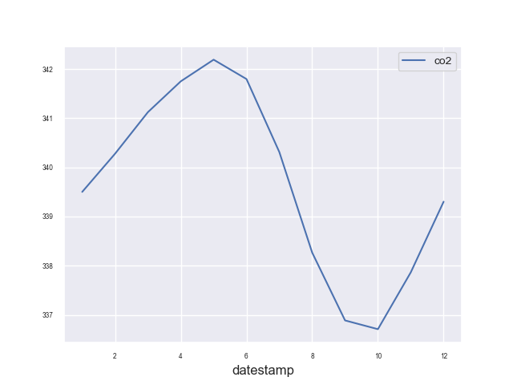

# Time Series Modeling 

Time series data consists of observations recorded at regular intervals, and time series forecasting aims to predict future values based on historical patterns and trends. This type of forecasting is critical across various domains, making it highly pertinent for machine learning practitioners. Applications such as risk scoring, fraud detection, and weather forecasting all benefit significantly from accurate time series predictions.

Deep learning, particularly neural networks, has only recently started to outperform traditional methods in time series forecasting, albeit by a smaller margin compared to its successes in image and language processing. Despite this, deep learning presents distinct advantages over other machine learning techniques, such as gradient-boosted trees. The primary advantage lies in the ability of neural network architectures to inherently understand time, automatically linking temporally close data points.

A Recurrent Neural Network (RNN) is a type of artificial neural network that includes memory or feedback loops, allowing it to recognize patterns in sequential data more effectively. The recurrent connections enable the network to consider both the current data sample and its previous hidden state, enhancing its ability to capture complex temporal dependencies. Some RNNs, like Long Short-Term Memory (LSTM) networks and Gated Recurrent Units (GRUs), have specialized memory mechanisms to remember significant events over extended time periods, which is essential for sequence learning tasks.

The distinguishing feature of sequence learning, compared to other regression and classification tasks, is the necessity to utilize models that can learn temporal dependencies in input data. LSTMs and GRUs excel in this regard, offering the ability to capture intricate time dependencies. Furthermore, neural networks employ continuous activation functions, making them particularly adept at interpolation in high-dimensional spaces, thereby optimizing inputs effectively.

Recent advancements in RNN variants, such as the Temporal Fusion Transformer (TFT), have further enhanced the capabilities of time series forecasting in physical science applications. These state-of-the-art models leverage advanced attention mechanisms and complex architectural innovations to provide superior predictive performance.

## Time Series EDA

- Let's start with calculating the rolling mean and standard deviation, adds upper and lower bounds, and visualizes the $CO_2$ levels data trends over time in a plot with enhanced aesthetics using seaborn:

~~~
import pandas as pd
import matplotlib.pyplot as plt
import seaborn as sns
plt.style.use('ggplot')
co2_levels = pd.read_csv('data/co2_levels.csv')

# Convert the 'timestamp' column to datetime format
co2_levels['datestamp'] = pd.to_datetime(co2_levels['datestamp'])

# Set the 'timestamp' column as the index
co2_levels.set_index('datestamp', inplace=True)

# Compute the 52 weeks rolling mean of the co2_levels DataFrame
ma = co2_levels.rolling(window=52).mean()

# Compute the 52 weeks rolling standard deviation of the co2_levels DataFrame
mstd = co2_levels.rolling(window=52).std()

# Add the upper bound column to the ma DataFrame
ma['upper'] = ma['co2'] + (mstd['co2'] * 2)

# Add the lower bound column to the ma DataFrame
ma['lower'] = ma['co2'] - (mstd['co2'] * 2)

# Plot the content of the ma DataFrame
ax = ma.plot(linewidth=0.8, fontsize=6)

# Specify labels, legend, and show the plot
ax.set_xlabel('Date', fontsize=10)
ax.set_ylabel(r'$CO_2$ levels', fontsize=10)
ax.set_title(r'Rolling mean and variance of $CO_2$ levels\n from 1958 to 2001', fontsize=10)
plt.show();

~~~
{: .python}

The increasing rolling mean of CO2 levels suggests a long-term upward trend in atmospheric $CO_2$ concentrations, which is a key indicator of climate change. This trend is likely driven by human activities and has important implications for the environment and global climate.

> ## Exercise: Plot the mean of $CO_2$ levels
> - Get the month for each dates in the index of $CO_2$ levels
> >  ## Solution
> >~~~
> >index_month = co2_levels.index.month
> ># Compute the mean  for each month of the year
> >mean_co2_levels_by_month = co2_levels.groupby(index_month).mean()
> > # Plot the mean 
> >mean_co2_levels_by_month.plot(fontsize=6)
> > # Specify the fontsize on the legend
> > plt.legend(fontsize=10);
> > ~~~
> > {: .python}
> {: .solution}
> 
{: .challenge}

