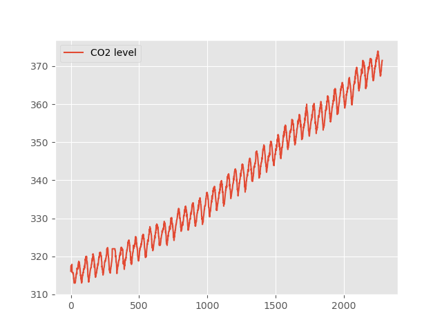
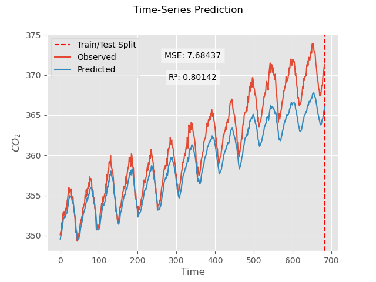

<!-- MathJax -->

## LSTM for Single-Variable Time Series Forecasting

Long Short-Term Memory (LSTM) networks are a type of recurrent neural network (RNN) that excel in learning from sequential data, making them particularly useful for time series forecasting. In this tutorial, we will explore how to implement an LSTM network to predict future values in a one-variable time series dataset.

We begin by loading necessary libraries such as NumPy, Matplotlib, and Pandas for data manipulation and visualization, along with PyTorch for building and training our neural network model. The dataset we'll use consists of monthly airline passenger numbers, a classic example in time series analysis.

First, we load the dataset and display the initial few rows to understand its structure:

~~~
import numpy as np
import matplotlib.pyplot as plt
import pandas as pd
import torch
import torch.nn as nn
plt.style.use("ggplot")
from torch.autograd import Variable
from sklearn.preprocessing import MinMaxScaler
df = pd.read_csv('data/co2_levels.csv')
df.head()
~~~
{: .python}

The dataset comprises two columns: `datestamp` and \\(CO_2\\). For our analysis, we will focus on the \\(CO_2\\) column as our variable of interest.

~~~
    datestamp    co2
0  1958-03-29  316.1
1  1958-04-05  317.3
2  1958-04-12  317.6
3  1958-04-19  317.5
4  1958-04-26  316.4
~~~
{: .output}

Next, we extract the passenger data and visualize it to get an initial sense of the time series trend.

~~~
training_set = df.iloc[:,1:2].values
plt.plot(training_set, label = 'CO2 level')
plt.legend()
plt.show()
~~~
{: .python}

This visualization step helps us understand the overall trend and seasonality in the data, setting the stage for building our LSTM model. Through this tutorial, you will learn how to preprocess the data, construct the LSTM network, and evaluate its performance in forecasting future passenger numbers.

To prepare the data for the LSTM, we need to normalize it. Normalization scales the data to a range between 0 and 1, which helps the neural network to train more efficiently and accurately.

~~~
# normalization
sc = MinMaxScaler()
training_data = sc.fit_transform(training_set)
training_data
~~~
{: .python}

~~~
array([[0.05090312],
       [0.07060755],
       [0.07553366],
       ...,
       [0.95566502],
       [0.95730706],
       [0.96059113]])
~~~
{: .output}

Through this section, you see  how to preprocess the data and proceed to construct the LSTM network, and evaluate its performance in forecasting future \\(CO_2 \\) levels. 

To effectively train an LSTM, it is crucial to organize the time series data into sequences that the network can learn from. This involves creating sliding windows of a fixed length, where each window represents a sequence of past values that will be used to predict the next value in the series. Here is a Python function to achieve this:

~~~
def sliding_windows(data, seq_length):
    x = []
    y = []

    for i in range(len(data)-seq_length-1):
        window = data[i:(i+seq_length)]
        after_window = data[i+seq_length]
        x.append(window)
        y.append(after_window)

    return np.array(x),np.array(y)

seq_length = 4
X, y = sliding_windows(training_data, seq_length)
X.shape, y.shape
~~~
{: .python} 

~~~
((2279, 4, 1), (2279, 1))
~~~
{: .output}

The arrays `X` and `y` store these windows and targets, respectively, and are converted to NumPy arrays for efficient computation.

By setting `seq_length = 4`, we generate sequences where each input sequence consists of four time steps, and the corresponding target is the value immediately following this sequence.

This preprocessing step prepares the data for the LSTM network, enabling it to learn from the sequential patterns in the time series and predict future \\(CO_2\\) levels based on past observations.

Next, we will proceed to construct tensor format preprocessed data  and the LSTM model to train it, ultimately evaluating its performance in forecasting future values.

~~~
# train and test data loading in tensor format
train_size = int(len(y) * 0.67)
test_size = len(y) - train_size

X_train = Variable(torch.Tensor(np.array(X)))
y_train = Variable(torch.Tensor(np.array(y)))

X_train = Variable(torch.Tensor(np.array(X[0:train_size])))
y_train = Variable(torch.Tensor(np.array(y[0:train_size])))

X_test = Variable(torch.Tensor(np.array(X[train_size:len(X)])))
y_test = Variable(torch.Tensor(np.array(y[train_size:len(y)])))

~~~
{: .python}

~~~
# the LSTM model building
class LSTM(nn.Module):

    def __init__(self, num_classes, input_size, hidden_size, num_layers):
        super(LSTM, self).__init__()

        self.num_classes = num_classes
        self.num_layers = num_layers
        self.input_size = input_size
        self.hidden_size = hidden_size
        self.seq_length = seq_length

        self.lstm = nn.LSTM(input_size=input_size, hidden_size=hidden_size,
                            num_layers=num_layers, batch_first=True)

        self.fc = nn.Linear(hidden_size, num_classes)

    def forward(self, x):
        h_0 = Variable(torch.zeros(
            self.num_layers, x.size(0), self.hidden_size))

        c_0 = Variable(torch.zeros(
            self.num_layers, x.size(0), self.hidden_size))

        # Propagate input through LSTM
        ula, (h_out, _) = self.lstm(x, (h_0, c_0))

        h_out = h_out.view(-1, self.hidden_size)

        out = self.fc(h_out)

        return out
~~~
{: .python}

~~~
# training the model
num_epochs = 2000
learning_rate = 0.01

input_size = 1
hidden_size = 2
num_layers = 1

num_classes = 1

lstm = LSTM(num_classes, input_size, hidden_size, num_layers)

criterion = torch.nn.MSELoss()    # mean-squared error for regression
optimizer = torch.optim.Adam(lstm.parameters(), lr=learning_rate)
#optimizer = torch.optim.SGD(lstm.parameters(), lr=learning_rate)

# Train the model
for epoch in range(num_epochs):
    outputs = lstm(X_train)
    optimizer.zero_grad()

    # obtain the loss function
    loss = criterion(outputs, y_train)

    loss.backward()

    optimizer.step()
    if epoch % 100 == 0:
      print("Epoch: %d, loss: %1.5f" % (epoch, loss.item()))
~~~
{: .python}

~~~
Epoch: 0, loss: 0.16193
Epoch: 100, loss: 0.02585
Epoch: 200, loss: 0.00042
Epoch: 300, loss: 0.00030
Epoch: 400, loss: 0.00024
Epoch: 500, loss: 0.00021
...
Epoch: 1500, loss: 0.00009
Epoch: 1600, loss: 0.00008
Epoch: 1700, loss: 0.00008
Epoch: 1800, loss: 0.00008
Epoch: 1900, loss: 0.00007
~~~
{: .output}

~~~
#Testing the model performance
lstm.eval()
train_predict = lstm(X_test)

data_predict = train_predict.data.numpy()
dataY_plot = y_test.data.numpy()

data_predict = sc.inverse_transform(data_predict)
dataY_plot = sc.inverse_transform(dataY_plot)

plt.axvline(x=test_size, c='r', linestyle='--')

plt.plot(dataY_plot)
plt.plot(data_predict)
plt.suptitle('Time-Series Prediction')
plt.show()
~~~

