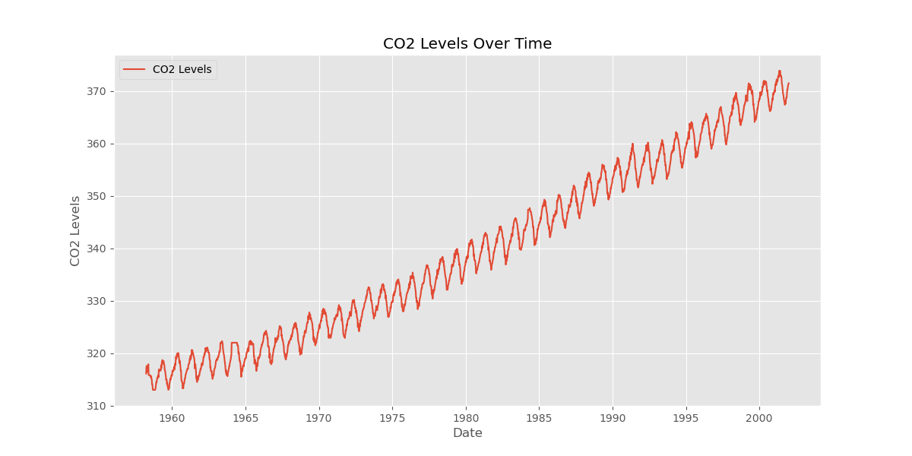
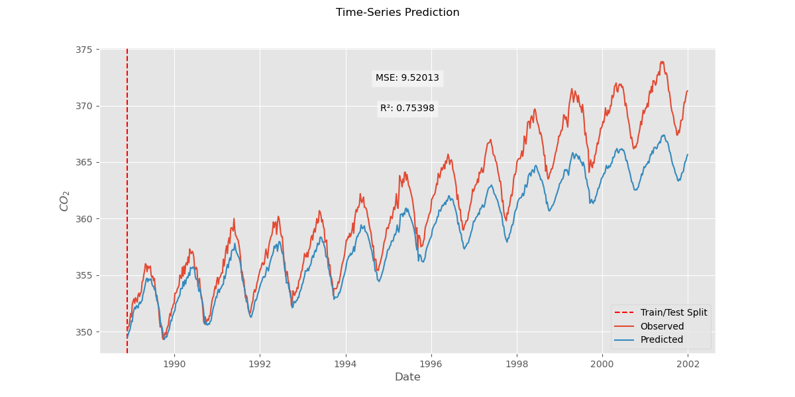

<!-- MathJax -->

## LSTM for Single-Variable Time Series Forecasting

Long Short-Term Memory (LSTM) networks are a type of recurrent neural network (RNN) that excel in learning from sequential data, making them particularly useful for time series forecasting. In this tutorial, we will explore how to implement an LSTM network to predict future values in a one-variable time series dataset.

We begin by loading necessary libraries such as NumPy, Matplotlib, and Pandas for data manipulation and visualization, along with PyTorch for building and training our neural network model. The dataset we'll use consists of monthly airline passenger numbers, a classic example in time series analysis.

First, we load the dataset and display the initial few rows to understand its structure:

~~~
import numpy as np
import matplotlib.pyplot as plt
import pandas as pd
import torch
import random
import torch.nn as nn
from torch.autograd import Variable
from sklearn.preprocessing import MinMaxScaler
from sklearn.metrics import mean_squared_error, r2_score
plt.style.use("ggplot")

# Set seed for reproducibility
seed = 42
np.random.seed(seed)
random.seed(seed)
torch.manual_seed(seed)
if torch.cuda.is_available():
    torch.cuda.manual_seed_all(seed)

# Load the dataset
df = pd.read_csv('data/co2_levels.csv')
# Convert 'datestamp' column to datetime format
df['datestamp'] = pd.to_datetime(df['datestamp'])
# Reindex the DataFrame before splitting
df = df.set_index('datestamp')
# Display the first few rows of the DataFrame
print(df.head())
~~~
{: .python}

The dataset comprises two columns: `datestamp` and \\(CO_2\\). For our analysis, we will focus on the \\(CO_2\\) column as our variable of interest.

~~~
            co2
datestamp        
1958-03-29  316.1
1958-04-05  317.3
1958-04-12  317.6
1958-04-19  317.5
1958-04-26  316.4
~~~
{: .output}

Next, we extract the passenger data and visualize it to get an initial sense of the time series trend.

~~~
# Plot the CO2 levels over time
plt.figure(figsize=(12, 6))
plt.plot(df.index, df['co2'], label='CO2 Levels')
plt.title('CO2 Levels Over Time')
plt.xlabel('Date')
plt.ylabel('CO2 Levels')
plt.legend()
plt.show()
~~~
{: .python}

This visualization step helps us understand the overall trend and seasonality in the data, setting the stage for building our LSTM model. Through this tutorial, you will learn how to preprocess the data, construct the LSTM network, and evaluate its performance in forecasting future passenger numbers.

### Normalization 

To prepare the data for the LSTM, we need to normalize it. Normalization scales the data to a range between 0 and 1, which helps the neural network to train more efficiently and accurately.

~~~
# normalization
sc = MinMaxScaler()
features = df.iloc[:,:].values
training_data = sc.fit_transform(features)
training_data
~~~
{: .python}

~~~
array([[0.05090312],
       [0.07060755],
       [0.07553366],
       ...,
       [0.95566502],
       [0.95730706],
       [0.96059113]])
~~~
{: .output}

Through this section, you see  how to preprocess the data and proceed to construct the LSTM network, and evaluate its performance in forecasting future \\(CO_2 \\) levels. 

### Data Windowing for Time Series

To effectively train an LSTM, it is crucial to organize the time series data into sequences that the network can learn from. This involves creating sliding windows of a fixed length, where each window represents a sequence of past values that will be used to predict the next value in the series.  RNN models makes predictions based on this sliding window of consecutive data samples. key features of input sliding windows include:

1. **Width**: Number of time steps in the input and label windows.
2. **Offset**: Time gap between input and label windows.
3. **Features**: Selection of features as inputs, labels, or both.

We will construct various models (Linear, DNN, CNN, RNN) for:
- Single-output and multi-output predictions.
- Single-time-step and multi-time-step predictions.

Depending on the task and type of model you may want to generate a variety of data windows. For instance, to make a single prediction 24 hours into the future, given 24 hours of history you migh define a window like this:

Forthermore, to make a prediction one hour into the future, given six hours of history would need a windos of input length six(6) with offset 1 as shown below:

In the remainder of this section, we define a `sliding_windows` class. This class can:

- Manage indexes and offsets.
- Split windows of features into feature (X) and label (y) pairs.
- Efficiently generate batches of these windows from the training and test data.

The sliding window generator class is crucial for preparing data for time series forecasting. The code below demonstrates its implementation:

~~~
class SlidingWindowGenerator:
    def __init__(self, seq_length, label_width, shift, df, label_columns=None):
        # Store the raw data.
        self.df = df

        # Label column indices.
        self.label_columns = label_columns
        if label_columns is not None:
            self.label_columns_indices = {name: i for i, name in enumerate(label_columns)}
        self.column_indices = {name: i for i, name in enumerate(df.columns)}

        # Window parameters.
        self.seq_length = seq_length
        self.label_width = label_width
        self.shift = shift
        self.total_window_size = seq_length + shift

        self.input_slice = slice(0, seq_length)
        self.input_indices = np.arange(self.total_window_size)[self.input_slice]

        self.label_start = self.total_window_size - label_width
        self.labels_slice = slice(self.label_start, None)
        self.label_indices = np.arange(self.total_window_size)[self.labels_slice]

    def __repr__(self):
        return '\n'.join([
            f'Total window size: {self.total_window_size}',
            f'Input indices: {self.input_indices}',
            f'Label indices: {self.label_indices}',
            f'Label column name(s): {self.label_columns}'])
    def sliding_windows(self, data):
        x = []
        y = []

        for i in range(len(data)-self.seq_length-1):
            window = data[i:(i+self.seq_length)]
            after_window = data[i+self.seq_length]
            x.append(window)
            y.append(after_window)

        return np.array(x), np.array(y)
~~~
{: .python}

The code initializes a sliding window generator with specified parameters, including input width, label width, and shift. Below is an example demonstrating how to create and use a sliding window generator with a DataFrame:
~~~
windows = SlidingWindowGenerator(seq_length=6, label_width=1, shift=1, df=df, label_columns=['co2'])
windows
~~~
{: .python}

~~~
Total window size: 7
Input indices: [0 1 2 3 4 5]
Label indices: [6]
Label column name(s): ['co2']
~~~
{: .output}

~~~
X, y = windows.sliding_windows(training_data)
X.shape, y.shape
~~~
{: .python}

~~~
((2277, 6, 1), (2277, 1))
~~~
{: .output}

The arrays `X` and `y` store these windows and targets, respectively, and are converted to NumPy arrays for efficient computation.

By setting `seq_length = 6`, we generate sequences length of 6 with offset 1 where each input sequence consists of six time steps, and the corresponding target is the value immediately following this sequence.

This preprocessing step prepares the data for the LSTM network, enabling it to learn from the sequential patterns in the time series and predict future \\(CO_2\\) levels based on past observations.

Next, we will proceed to construct tensor format preprocessed data  and the LSTM model to train it, ultimately evaluating its performance in forecasting future values.

First, we need to split the dataset into training and testing sets and convert them into tensors, which are the primary data structure used in PyTorch.

~~~
# train and test data loading in tensor format
train_size = int(len(y) * 0.7)
test_size = len(y) - train_size

X_train = Variable(torch.Tensor(np.array(X)))
y_train = Variable(torch.Tensor(np.array(y)))

X_train = Variable(torch.Tensor(np.array(X[0:train_size])))
y_train = Variable(torch.Tensor(np.array(y[0:train_size])))

X_test = Variable(torch.Tensor(np.array(X[train_size:len(X)])))
y_test = Variable(torch.Tensor(np.array(y[train_size:len(y)])))

~~~
{: .python}

Here, train_size is set to 70% of the dataset, while test_size is the remaining 30%. We convert the respective segments of X and y into PyTorch tensors using Variable.

Next, we define our LSTM model by creating a class that inherits from nn.Module. This class includes the initialization of the LSTM and a forward method to define the forward pass of the network.

~~~
# the LSTM model building
class LSTM(nn.Module):

    def __init__(self, num_classes, input_size, hidden_size, num_layers):
        super(LSTM, self).__init__()

        self.num_classes = num_classes
        self.num_layers = num_layers
        self.input_size = input_size
        self.hidden_size = hidden_size
        self.seq_length = seq_length

        self.lstm = nn.LSTM(input_size=input_size, hidden_size=hidden_size,
                            num_layers=num_layers, batch_first=True)

        self.fc = nn.Linear(hidden_size, num_classes)

    def forward(self, x):
        h_0 = Variable(torch.zeros(
            self.num_layers, x.size(0), self.hidden_size))

        c_0 = Variable(torch.zeros(
            self.num_layers, x.size(0), self.hidden_size))

        # Propagate input through LSTM
        ula, (h_out, _) = self.lstm(x, (h_0, c_0))

        h_out = h_out.view(-1, self.hidden_size)

        out = self.fc(h_out)

        return out
~~~
{: .python}

Now, we train the LSTM model. We set the number of epochs, learning rate, and other hyperparameters. We use mean squared error (MSE) as the loss function and Adam optimizer for training.
~~~
# training the model
num_epochs = 2000
learning_rate = 0.01

input_size = 1
hidden_size = 3
num_layers = 1
num_classes = 1

lstm = LSTM(num_classes, input_size, hidden_size, num_layers)

criterion = torch.nn.MSELoss()    # mean-squared error for regression
optimizer = torch.optim.Adam(lstm.parameters(), lr=learning_rate)
#optimizer = torch.optim.SGD(lstm.parameters(), lr=learning_rate)

# Train the model
for epoch in range(num_epochs):
    outputs = lstm(X_train)
    optimizer.zero_grad()

    # obtain the loss function
    loss = criterion(outputs, y_train)

    loss.backward()

    optimizer.step()
    if epoch % 100 == 0:
      print("Epoch: %d, loss: %1.5f" % (epoch, loss.item()))
~~~
{: .python}

~~~
Epoch: 0, loss: 0.44187
Epoch: 100, loss: 0.01010
Epoch: 200, loss: 0.00023
Epoch: 300, loss: 0.00016
Epoch: 400, loss: 0.00014
Epoch: 500, loss: 0.00013
Epoch: 600, loss: 0.00012
...
Epoch: 1500, loss: 0.00010
Epoch: 1600, loss: 0.00010
Epoch: 1700, loss: 0.00010
Epoch: 1800, loss: 0.00010
Epoch: 1900, loss: 0.00009
~~~
{: .output}
The training loop runs for 2000 epochs, and the loss is printed every 100 epochs to monitor the training process.

After training, we evaluate the model's performance on the test data. We set the model to evaluation mode and generate predictions for the test set. These predictions and the actual values are then inverse-transformed to their original scale for visualization.

~~~
# Testing the model performance
lstm.eval()
test_predict = lstm(X_test)

# Convert predictions to numpy arrays and reshape
data_predict = test_predict.data.numpy().reshape(-1, 1)
dataY_plot = y_test.data.numpy().reshape(-1, 1)

# Inverse transform the predictions and actual values
data_predict = sc.inverse_transform(data_predict)
dataY_plot = sc.inverse_transform(dataY_plot)

# Compute MSE and R²
mse = mean_squared_error(dataY_plot, data_predict)
r2 = r2_score(dataY_plot, data_predict)

# Get the test datestamps
test_size = len(dataY_plot)
test_dates = df.index[-test_size:]

# Plot observed and predicted values
plt.figure(figsize=(12, 6))
plt.axvline(x=test_dates[0], c='r', linestyle='--', label='Train/Test Split')
plt.plot(test_dates, dataY_plot, label='Observed')
plt.plot(test_dates, data_predict, label='Predicted')
plt.suptitle('Time-Series Prediction')
plt.xlabel('Date')
plt.ylabel(r'$CO_2$')
plt.legend()

# Add MSE and R2 values as annotations
plt.text(0.5, 0.9, f'MSE: {mse:.5f}', ha='center', va='center', transform=plt.gca().transAxes, bbox=dict(facecolor='white', alpha=0.5))
plt.text(0.5, 0.8, f'R²: {r2:.5f}', ha='center', va='center', transform=plt.gca().transAxes, bbox=dict(facecolor='white', alpha=0.5))
plt.tight_layout()
plt.show()
~~~

In the plot, the red vertical line separates the training data from the test data. The model's performance in predicting the time series is visualized by plotting the predicted values against the actual values.

By following these steps, you will preprocess the data, construct an LSTM network, train it, and evaluate its performance in forecasting future \\(CO_2\\) levels.

> ## Exercise: How to impove the model performance?
> - Modify the sequence length  to 5 used in the LSTM model and observe its impact on the model's performance.
> - Modify the hidden layers of the LSTM model to 5 and retain the model and plot the observed vs prediction for `X_test`
> 
> > ## Solution
> > ~~~
> > # Modify the sequence length to 5
> > seq_length = 5
> > X, y = sliding_windows(training_data, seq_length)
> > # Train and test data loading in tensor format
> > train_size = int(len(y) * 0.70)
> > test_size = len(y) - train_size
> > X_train = Variable(torch.Tensor(np.array(X[0:train_size])))
> > y_train = Variable(torch.Tensor(np.array(y[0:train_size])))
> > X_test = Variable(torch.Tensor(np.array(X[train_size:len(X)])))
> > y_test = Variable(torch.Tensor(np.array(y[train_size:len(y)])))
> > # LSTM model building
> > class LSTM(nn.Module):
> >    def __init__(self, num_classes, input_size, hidden_size, num_layers):
> >        super(LSTM, self).__init__()
> >        
> >        self.num_classes = num_classes
> >        self.num_layers = num_layers
> >        self.input_size = input_size
> >        self.hidden_size = hidden_size
> >        self.seq_length = seq_length
> >        self.lstm = nn.LSTM(input_size=input_size, hidden_size=hidden_size,
> >                            num_layers=num_layers, batch_first=True)
> >        self.fc = nn.Linear(hidden_size, num_classes)
> >    def forward(self, x):
> >        h_0 = Variable(torch.zeros(
> >           self.num_layers, x.size(0), self.hidden_size))
> >        c_0 = Variable(torch.zeros(
> >            self.num_layers, x.size(0), self.hidden_size))
> >        ula, (h_out, _) = self.lstm(x, (h_0, c_0))
> >        h_out = h_out.view(-1, self.hidden_size)
> >        out = self.fc(h_out)
> >        return out
> > # Training the model
> > num_epochs = 2000
> > learning_rate = 0.01
> > input_size = 1
> > hidden_size = 5
> > num_layers = 1
> > num_classes = 1
> > lstm = LSTM(num_classes, input_size, hidden_size, num_layers)
> > criterion = torch.nn.MSELoss()    # Mean-squared error for regression
> > optimizer = torch.optim.Adam(lstm.parameters(), lr=learning_rate)
> > # Train the model
> > for epoch in range(num_epochs):
> >    outputs = lstm(X_train)
> >    optimizer.zero_grad()   
> >    loss = criterion(outputs, y_train)
> >    loss.backward()
> >    optimizer.step()    
> >    if epoch % 100 == 0:
> >        print("Epoch: %d, loss: %1.5f" % (epoch, loss.item()))
> > # Testing the model performance
> > from sklearn.metrics import mean_squared_error, r2_score
> > lstm.eval()
> > train_predict = lstm(X_test)
> > data_predict = train_predict.data.numpy()
> > dataY_plot = y_test.data.numpy()
> > # Inverse transform the predictions and actual values
> > data_predict = sc.inverse_transform(data_predict)
> > dataY_plot = sc.inverse_transform(dataY_plot)
> > # Compute MSE and R²
> > mse = mean_squared_error(dataY_plot, data_predict)
> > r2 = r2_score(dataY_plot, data_predict)
> > # Get the test datestamps
> > test_dates = df.index[train_size + seq_length + 1:]
> > # Plot observed and predicted values
> > plt.figure(figsize=(12, 6))
> > plt.axvline(x=test_dates[0], c='r', linestyle='--', label='Train/Test Split')
> > plt.plot(df.index[train_size + seq_length + 1:], dataY_plot, label='Observed')
> > plt.plot(df.index[train_size + seq_length + 1:], data_predict, label='Predicted')
> > plt.suptitle('Time-Series Prediction')
> > plt.xlabel('Date')
> > plt.ylabel(r'$CO_2$')
> > plt.legend()
> > # Add MSE and R2 values as annotations
> > plt.text(0.5, 0.9, f'MSE: {mse:.5f}', ha='center', va='center', transform=plt.gca().transAxes, bbox=dict(facecolor='white', alpha=0.5))
> > plt.text(0.5, 0.8, f'R²: {r2:.5f}', ha='center', va='center', transform=plt.gca().transAxes, bbox=dict(facecolor='white', alpha=0.5))
> > plt.show()
> > ~~~
> > {: .python}
> > 
> {: .solution}
>
{: .challenge}

