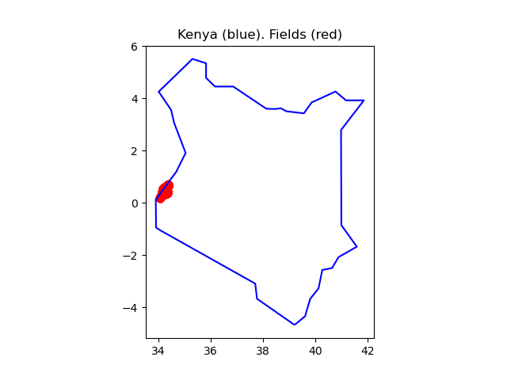
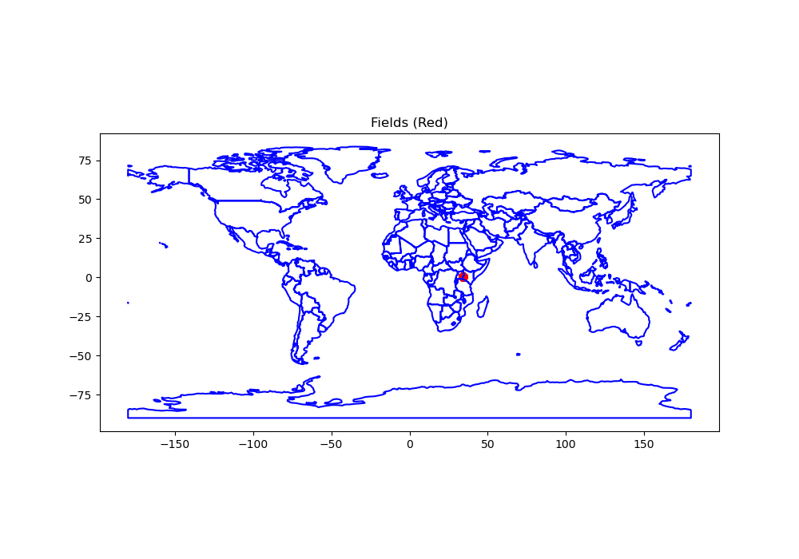
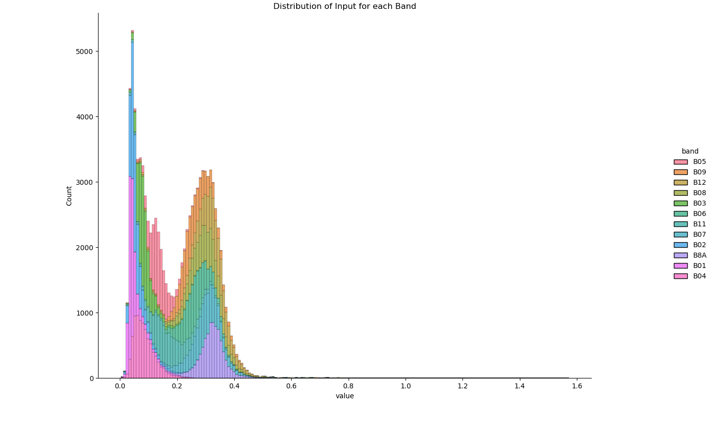

## Crop Type Classification in Africa 

In this section, we aim to classify farm-level crop types in Kenya by leveraging Geospatial machine learning techniques with Sentinel-2 satellite imagery. This endeavor involves a supervised multiclass classification problem where we utilize pixel-level Sentinel-2 satellite imagery as the primary input for our model. The imagery comprises 12 bands of observations from Sentinel-2 L2A, encompassing various spectra such as ultra-blue, blue, green, red, visible and near-infrared (VNIR), and short wave infrared (SWIR), along with a cloud probability layer. Each pixel contains measurements for 13 dates spanning the entire farming season.

### Sentinel-2 Satellite Imagery Bands Details

The twelve bands utilized in the imagery are as follows:
- B01 (Coastal aerosol)
- B02 (Blue)
- B03 (Green)
- B04 (Red)
- B05 (Red Edge 1)
- B06 (Red Edge 2)
- B07 (Red Edge 3)
- B08 (NIR - Near Infrared)
- B8A (Red Edge 4)
- B09 (Water vapor)
- B11 (SWIR - Shortwave Infrared 1)
- B12 (SWIR - Shortwave Infrared 2)

The cloud probability layer, derived from the Sentinel-2 atmospheric correction algorithm (Sen2Cor), furnishes an estimated cloud probability (ranging from 0 to 100%) for each pixel.

### Crop Classification Categories

The objective is to classify each farm into one of the following categories:
1. Maize
2. Cassava
3. Common Bean
4. Maize & Common Bean (intercropping)
5. Maize & Cassava (intercropping)
6. Maize & Soybean (intercropping)
7. Cassava & Common Bean (intercropping)

### Model Validation and Performance Measurement

__Validation Method:__ 
We will perform a random train-validation split based on farm IDs.

__Performance Metric:__ 
The evaluation metric employed is cross-entropy. For each farm field ID, the model is expected to predict the probability of the farm containing a specific crop type.

### Data Preparation

In this phase, the dataset will undergo the following steps:
- Removal of pixels with cloud probability exceeding 50%
- Data split into train/validation/test sets
- Ensuring absence of data leakage in the sets
- Examination of channel or band distributions
- Mapping of farms by their labels
- Visualization of a single farm's NDVI evolution over time (13 dates)

~~~
import pandas as pd

df = pd.read_feather("data/df.feather")
df.head()
~~~
{: .python}

~~~
band       time       lat        lon  field  crop     B01     B02     B03     B04     B05     B06     B07     B08     B09     B11     B12     B8A
0    2019-06-06  0.168064  34.042872   2067     0  0.0192  0.0397  0.0722  0.0520  0.1063  0.2664  0.3255  0.3292  0.1973  0.1044  0.3425  0.3312
1    2019-06-06  0.168064  34.042962   2067     0  0.0192  0.0402  0.0700  0.0468  0.1085  0.3042  0.3770  0.3372  0.2088  0.1107  0.3929  0.3312
2    2019-06-06  0.168064  34.043411   1020     2  0.0248  0.0286  0.0673  0.0395  0.1144  0.3462  0.4254  0.4288  0.2325  0.1281  0.4477  0.3812
3    2019-06-06  0.168064  34.043501   1020     2  0.0248  0.0268  0.0583  0.0321  0.1085  0.3404  0.4207  0.4640  0.2368  0.1403  0.4400  0.3812
4    2019-06-06  0.168064  34.043591   1020     2  0.0248  0.0256  0.0559  0.0368  0.1085  0.3404  0.4207  0.4540  0.2368  0.1403  0.4400  0.3812
~~~
{: .output}

To visualize the fields in Kenya on a map using Sentinel-2 satellite imagery data :
~~~
# Sample one pixel per field to simplify visualization
report = df.copy()
report = report.sample(frac=1)
report = report[["field", "lat", "lon"]].drop_duplicates()
report = gpd.GeoDataFrame(report, geometry=[Point(xy) for xy in zip(report['lon'], report['lat'])])
report = report[["field", "geometry"]].drop_duplicates(subset="field")

# Get Kenya
with warnings.catch_warnings():
  warnings.filterwarnings("ignore", category=FutureWarning)
  world = gpd.read_file(gpd.datasets.get_path('naturalearth_lowres'))
kenya = world[world['name'] == 'Kenya']

# Plot Kenya and our fields
fig, ax = plt.subplots()
_ = kenya.boundary.plot(ax=ax, color="blue")
_ = report.plot(ax=ax, color="red")
ax.set_title("Kenya (blue). Fields (red)")
plt.show()
~~~
{: .python}

To plot the data globally, showcasing country boundaries and the fields on a map as:
~~~
#@title plot the data globally

# Plot country boundaries and our fields
fig, ax = plt.subplots(figsize=(10, 7))
_ = world.boundary.plot(ax=ax, color="blue")
_ = report.plot(ax=ax, color="red")
ax.set_title("Fields (Red)")
plt.show()
~~~
{: .python}

Each (pixel, time) is a row. Let's start by removing the pixels that are cloudy:

~~~
# Drop pixels that have a cloud cover greater than 50
df = df[df["CLD"] < 50]

# No need to keep the `CLD` column anymore
df = df.drop(columns=["CLD"])
~~~

check if we have any missing values:

~~~
# Check for missing values
if df.isnull().values.any():
    # Drop rows with missing values
    df = df.dropna()
    print(f"Dropped {df.shape[0]} rows with missing values.")
else:
    print("No missing values found in the dataframe.")
~~~
{: .python}

~~~
No missing values found in the dataframe.
~~~
{: .output}

Let's  focuse on splitting the data into training, validation, and test sets based on the 'field' column. The dataset is divided into 'deploy' and the remaining rows, with 'deploy' containing hidden labels marked with 'crop == 0'. The unique field IDs are extracted from the non-deploy rows, and a random 80/10/10 split is performed for training, validation, and testing sets.

~~~
import numpy as np

# Set seed for reproducibility
np.random.seed(42)

# Split data into train, val, and test sets based on field column
deploy = df[df["crop"] == 0]
train_val_test = df[~df["field"].isin(deploy["field"])]

# Randomly assign field IDs for train, val, and test sets
train_val_test_field_ids = train_val_test["field"].unique()
np.random.shuffle(train_val_test_field_ids)

# Calculate sizes for train, val, and test sets
total_fields = len(train_val_test_field_ids)
val_size = int(total_fields * 0.1)
test_size = int(total_fields * 0.1)
train_size = total_fields - val_size - test_size

# Assign field IDs to train, val, and test sets
train_field_ids = train_val_test_field_ids[:train_size]
val_field_ids = train_val_test_field_ids[train_size:train_size + val_size]
test_field_ids = train_val_test_field_ids[train_size + val_size:]

# Create train, val, and test sets
train = train_val_test[train_val_test["field"].isin(train_field_ids)]
val = train_val_test[train_val_test["field"].isin(val_field_ids)]
test = train_val_test[train_val_test["field"].isin(test_field_ids)]

# Print shapes of train, val, and test sets
train.shape, val.shape, test.shape
~~~
{: .python}

The resulting sets are named 'train', 'val', and 'test', respectively. 
~~~
((475014, 17), (59183, 17), (64530, 17))
~~~
{: .output}

Let's verify that no data leakage is happening. We define leakage as follows:

>> A validation or test farm pixels in the training dataframe (or the reverse).

~~~
# Verify that the sets of field IDs from `train`, `val`, and `test` are mutually exclusive
assert len(set(train["field"].unique()).intersection(set(val["field"].unique()))) == 0
assert len(set(train["field"].unique()).intersection(set(test["field"].unique()))) == 0
assert len(set(val["field"].unique()).intersection(set(test["field"].unique()))) == 0
~~~
{: .python}

Next, let's check the distribution of the band values we have:

~~~
import matplotlib.pyplot as plt
import seaborn as sns
g = sns.displot(data=train.drop(columns=["time", "lat", "lon", "field", "crop"]).melt().sample(100_000), x='value', hue="band", multiple='stack')
plt.title('Distribution of Input for each Band')
plt.show()
~~~
{: .python}

